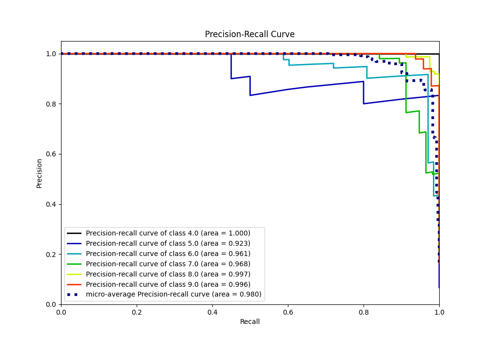

# Summary of 63_NeuralNetwork

[<< Go back](../README.md)

## Neural Network
- **n_jobs**: -1
- **dense_1_size**: 16
- **dense_2_size**: 16
- **learning_rate**: 0.01
- **num_class**: 6
- **explain_level**: 0

## Validation
 - **validation_type**: kfold
 - **k_folds**: 5

## Optimized metric
accuracy

## Training time

4.8 seconds

### Metric details
|           |   4.0 |       5.0 |       6.0 |       7.0 |       8.0 |       9.0 |   accuracy |   macro avg |   weighted avg |   logloss |
|:----------|------:|----------:|----------:|----------:|----------:|----------:|-----------:|------------:|---------------:|----------:|
| precision |     1 |  0.888889 |  0.898551 |  0.912281 |  0.962963 |  0.958333 |   0.935154 |    0.936836 |       0.934868 |  0.260964 |
| recall    |     1 |  0.8      |  0.911765 |  0.912281 |  0.975    |  0.958333 |   0.935154 |    0.92623  |       0.935154 |  0.260964 |
| f1-score  |     1 |  0.842105 |  0.905109 |  0.912281 |  0.968944 |  0.958333 |   0.935154 |    0.931129 |       0.93483  |  0.260964 |
| support   |    20 | 20        | 68        | 57        | 80        | 48        |   0.935154 |  293        |     293        |  0.260964 |

## Confusion matrix
|                |   Predicted as 4.0 |   Predicted as 5.0 |   Predicted as 6.0 |   Predicted as 7.0 |   Predicted as 8.0 |   Predicted as 9.0 |
|:---------------|-------------------:|-------------------:|-------------------:|-------------------:|-------------------:|-------------------:|
| Labeled as 4.0 |                 20 |                  0 |                  0 |                  0 |                  0 |                  0 |
| Labeled as 5.0 |                  0 |                 16 |                  4 |                  0 |                  0 |                  0 |
| Labeled as 6.0 |                  0 |                  1 |                 62 |                  4 |                  1 |                  0 |
| Labeled as 7.0 |                  0 |                  1 |                  3 |                 52 |                  0 |                  1 |
| Labeled as 8.0 |                  0 |                  0 |                  0 |                  1 |                 78 |                  1 |
| Labeled as 9.0 |                  0 |                  0 |                  0 |                  0 |                  2 |                 46 |

## Learning curves

## Confusion Matrix

## Normalized Confusion Matrix

## ROC Curve

## Precision Recall Curve

[<< Go back](../README.md)
