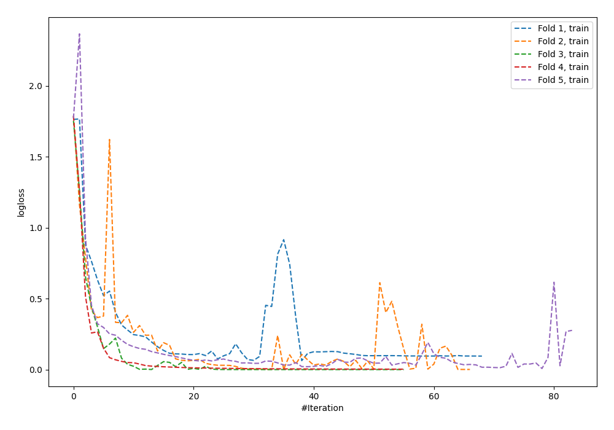
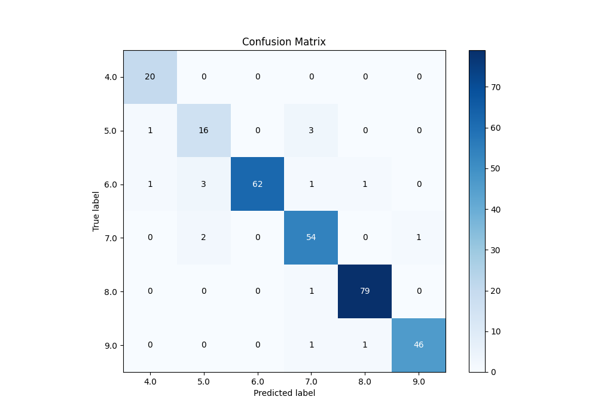
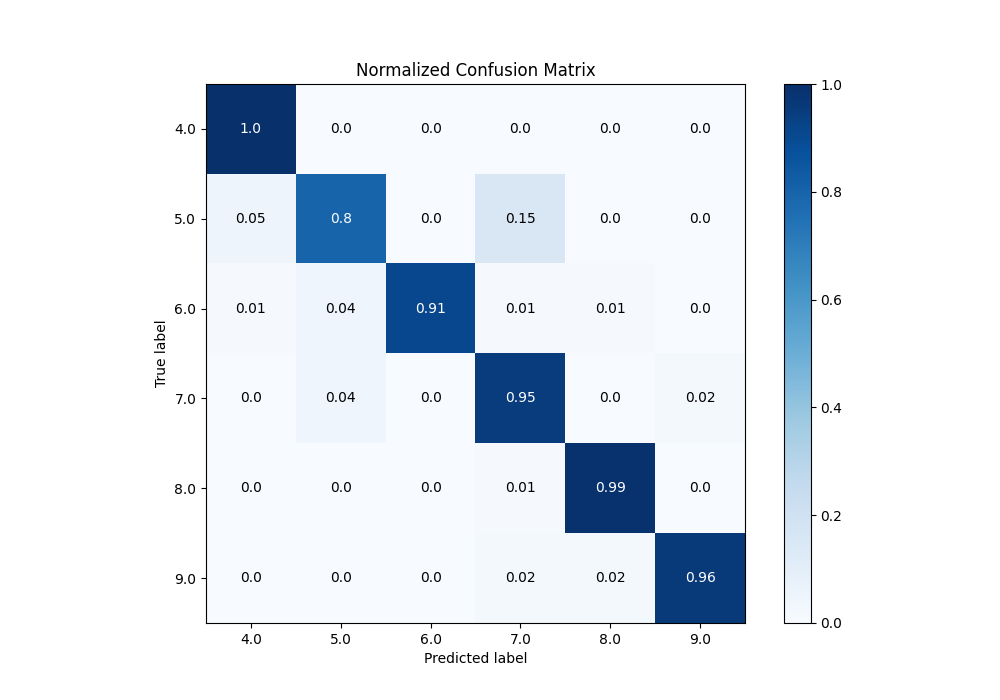
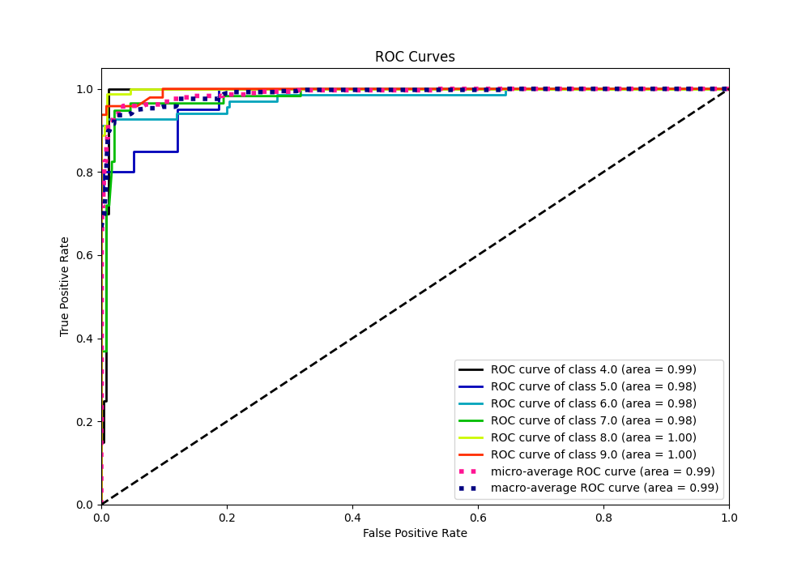
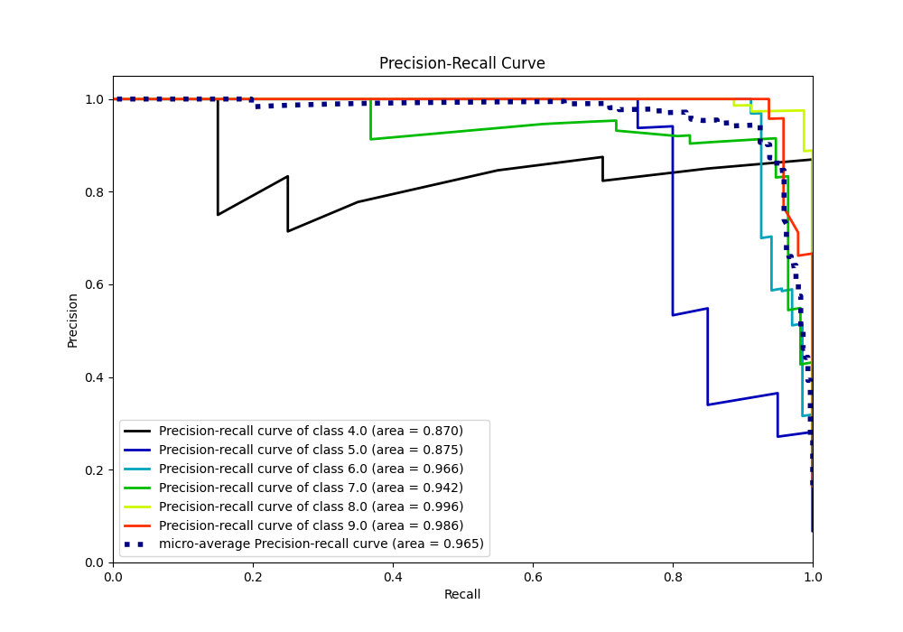

# Summary of 64_NeuralNetwork

[<< Go back](../README.md)

## Neural Network
- **n_jobs**: -1
- **dense_1_size**: 64
- **dense_2_size**: 8
- **learning_rate**: 0.1
- **num_class**: 6
- **explain_level**: 0

## Validation
 - **validation_type**: kfold
 - **k_folds**: 5

## Optimized metric
accuracy

## Training time

5.2 seconds

### Metric details
|           |       4.0 |       5.0 |       6.0 |       7.0 |       8.0 |       9.0 |   accuracy |   macro avg |   weighted avg |   logloss |
|:----------|----------:|----------:|----------:|----------:|----------:|----------:|-----------:|------------:|---------------:|----------:|
| precision |  0.909091 |  0.761905 |  1        |  0.9      |  0.975309 |  0.978723 |   0.945392 |    0.920838 |       0.947861 |   0.34797 |
| recall    |  1        |  0.8      |  0.911765 |  0.947368 |  0.9875   |  0.958333 |   0.945392 |    0.934161 |       0.945392 |   0.34797 |
| f1-score  |  0.952381 |  0.780488 |  0.953846 |  0.923077 |  0.981366 |  0.968421 |   0.945392 |    0.926597 |       0.945829 |   0.34797 |
| support   | 20        | 20        | 68        | 57        | 80        | 48        |   0.945392 |  293        |     293        |   0.34797 |

## Confusion matrix
|                |   Predicted as 4.0 |   Predicted as 5.0 |   Predicted as 6.0 |   Predicted as 7.0 |   Predicted as 8.0 |   Predicted as 9.0 |
|:---------------|-------------------:|-------------------:|-------------------:|-------------------:|-------------------:|-------------------:|
| Labeled as 4.0 |                 20 |                  0 |                  0 |                  0 |                  0 |                  0 |
| Labeled as 5.0 |                  1 |                 16 |                  0 |                  3 |                  0 |                  0 |
| Labeled as 6.0 |                  1 |                  3 |                 62 |                  1 |                  1 |                  0 |
| Labeled as 7.0 |                  0 |                  2 |                  0 |                 54 |                  0 |                  1 |
| Labeled as 8.0 |                  0 |                  0 |                  0 |                  1 |                 79 |                  0 |
| Labeled as 9.0 |                  0 |                  0 |                  0 |                  1 |                  1 |                 46 |

## Learning curves

## Confusion Matrix

## Normalized Confusion Matrix

## ROC Curve

## Precision Recall Curve

[<< Go back](../README.md)
