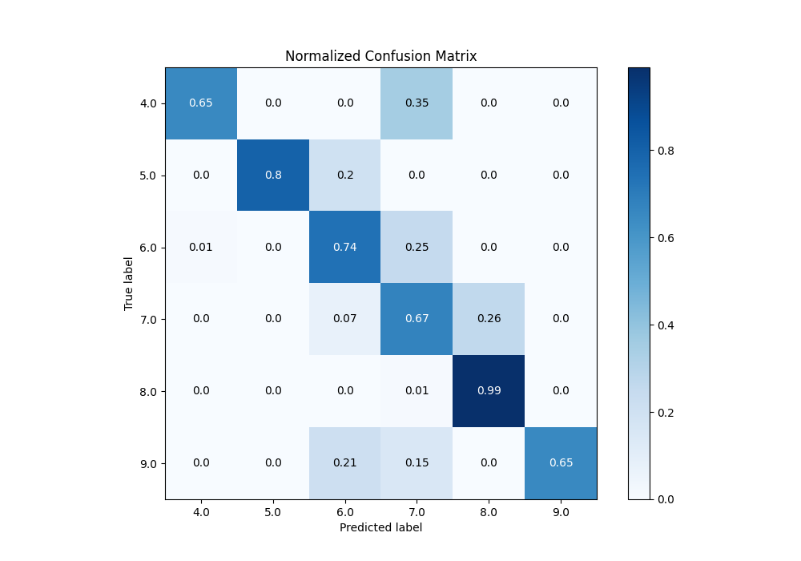

# Summary of 64_NeuralNetwork_Stacked

[<< Go back](../README.md)

## Neural Network
- **n_jobs**: -1
- **dense_1_size**: 64
- **dense_2_size**: 8
- **learning_rate**: 0.1
- **num_class**: 6
- **explain_level**: 0

## Validation
 - **validation_type**: kfold
 - **k_folds**: 5

## Optimized metric
accuracy

## Training time

28.9 seconds

### Metric details
|           |       4.0 |       5.0 |       6.0 |       7.0 |       8.0 |       9.0 |   accuracy |   macro avg |   weighted avg |   logloss |
|:----------|----------:|----------:|----------:|----------:|----------:|----------:|-----------:|------------:|---------------:|----------:|
| precision |  0.928571 |  1        |  0.735294 |  0.542857 |  0.840426 |  1        |   0.774744 |    0.841191 |       0.801189 |  0.680486 |
| recall    |  0.65     |  0.8      |  0.735294 |  0.666667 |  0.9875   |  0.645833 |   0.774744 |    0.747549 |       0.774744 |  0.680486 |
| f1-score  |  0.764706 |  0.888889 |  0.735294 |  0.598425 |  0.908046 |  0.78481  |   0.774744 |    0.780028 |       0.776439 |  0.680486 |
| support   | 20        | 20        | 68        | 57        | 80        | 48        |   0.774744 |  293        |     293        |  0.680486 |

## Confusion matrix
|                |   Predicted as 4.0 |   Predicted as 5.0 |   Predicted as 6.0 |   Predicted as 7.0 |   Predicted as 8.0 |   Predicted as 9.0 |
|:---------------|-------------------:|-------------------:|-------------------:|-------------------:|-------------------:|-------------------:|
| Labeled as 4.0 |                 13 |                  0 |                  0 |                  7 |                  0 |                  0 |
| Labeled as 5.0 |                  0 |                 16 |                  4 |                  0 |                  0 |                  0 |
| Labeled as 6.0 |                  1 |                  0 |                 50 |                 17 |                  0 |                  0 |
| Labeled as 7.0 |                  0 |                  0 |                  4 |                 38 |                 15 |                  0 |
| Labeled as 8.0 |                  0 |                  0 |                  0 |                  1 |                 79 |                  0 |
| Labeled as 9.0 |                  0 |                  0 |                 10 |                  7 |                  0 |                 31 |

## Learning curves

## Confusion Matrix

## Normalized Confusion Matrix

## ROC Curve

## Precision Recall Curve

[<< Go back](../README.md)
