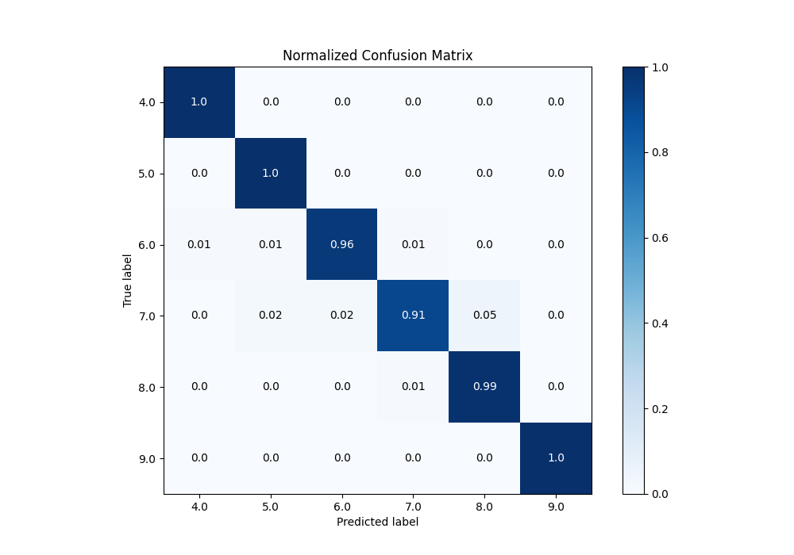

# Summary of 68_NearestNeighbors

[<< Go back](../README.md)

## k-Nearest Neighbors (Nearest Neighbors)
- **n_jobs**: -1
- **n_neighbors**: 7
- **weights**: distance
- **num_class**: 6
- **explain_level**: 0

## Validation
 - **validation_type**: kfold
 - **k_folds**: 5

## Optimized metric
accuracy

## Training time

3.5 seconds

### Metric details
|           |       4.0 |       5.0 |       6.0 |       7.0 |       8.0 |   9.0 |   accuracy |   macro avg |   weighted avg |   logloss |
|:----------|----------:|----------:|----------:|----------:|----------:|------:|-----------:|------------:|---------------:|----------:|
| precision |  0.952381 |  0.909091 |  0.984848 |  0.962963 |  0.963415 |     1 |   0.969283 |    0.962116 |       0.969833 |  0.202601 |
| recall    |  1        |  1        |  0.955882 |  0.912281 |  0.9875   |     1 |   0.969283 |    0.975944 |       0.969283 |  0.202601 |
| f1-score  |  0.97561  |  0.952381 |  0.970149 |  0.936937 |  0.975309 |     1 |   0.969283 |    0.968398 |       0.969147 |  0.202601 |
| support   | 20        | 20        | 68        | 57        | 80        |    48 |   0.969283 |  293        |     293        |  0.202601 |

## Confusion matrix
|                |   Predicted as 4.0 |   Predicted as 5.0 |   Predicted as 6.0 |   Predicted as 7.0 |   Predicted as 8.0 |   Predicted as 9.0 |
|:---------------|-------------------:|-------------------:|-------------------:|-------------------:|-------------------:|-------------------:|
| Labeled as 4.0 |                 20 |                  0 |                  0 |                  0 |                  0 |                  0 |
| Labeled as 5.0 |                  0 |                 20 |                  0 |                  0 |                  0 |                  0 |
| Labeled as 6.0 |                  1 |                  1 |                 65 |                  1 |                  0 |                  0 |
| Labeled as 7.0 |                  0 |                  1 |                  1 |                 52 |                  3 |                  0 |
| Labeled as 8.0 |                  0 |                  0 |                  0 |                  1 |                 79 |                  0 |
| Labeled as 9.0 |                  0 |                  0 |                  0 |                  0 |                  0 |                 48 |

## Learning curves

## Confusion Matrix

## Normalized Confusion Matrix

## ROC Curve

## Precision Recall Curve

[<< Go back](../README.md)
