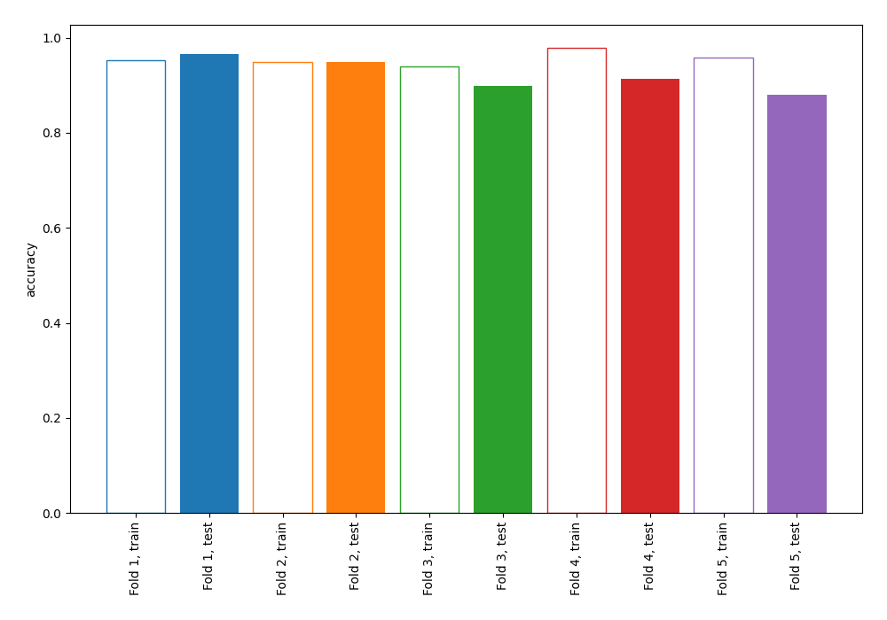
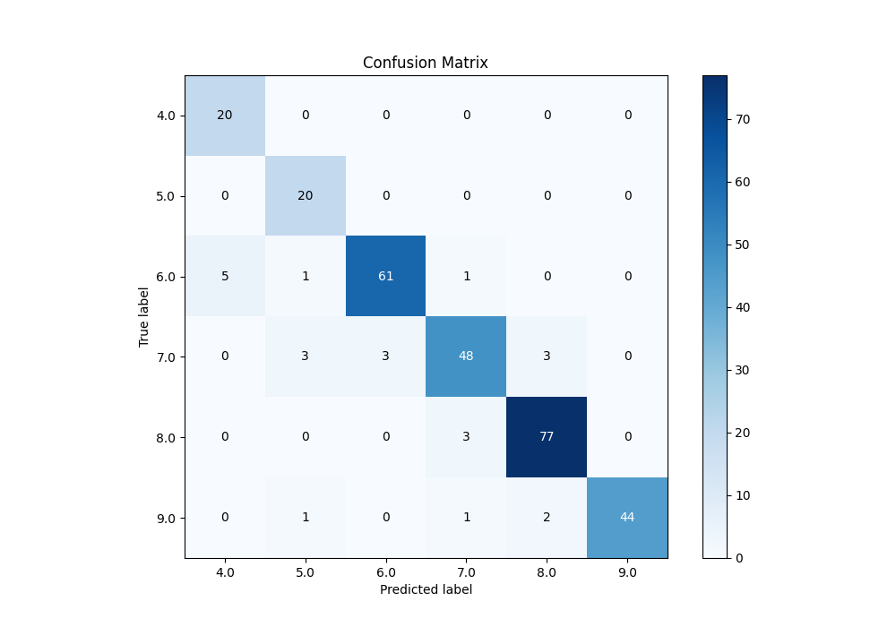
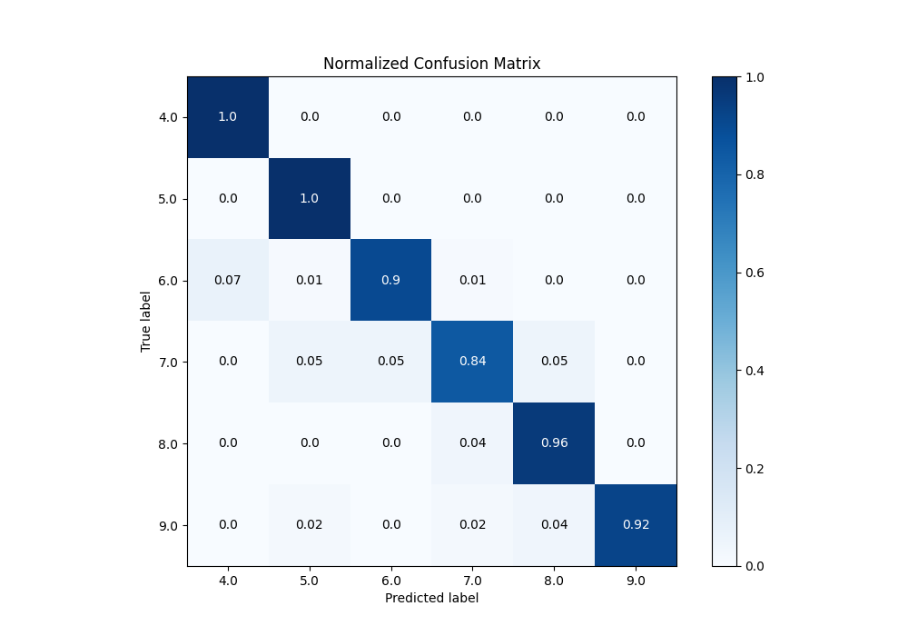
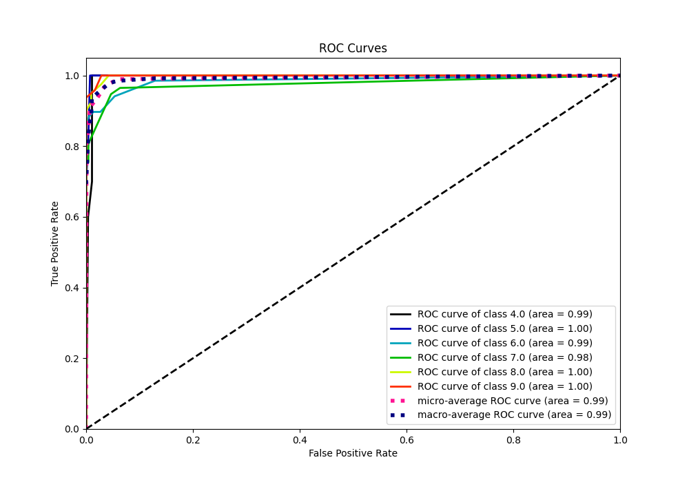
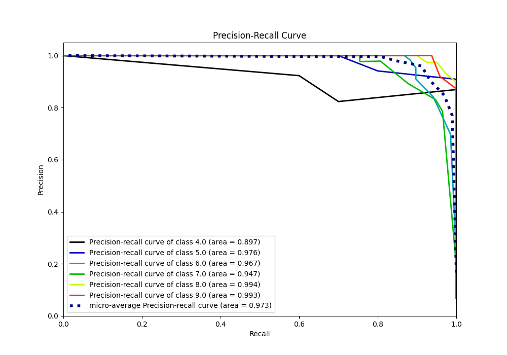

# Summary of 71_NearestNeighbors

[<< Go back](../README.md)

## k-Nearest Neighbors (Nearest Neighbors)
- **n_jobs**: -1
- **n_neighbors**: 7
- **weights**: uniform
- **num_class**: 6
- **explain_level**: 0

## Validation
 - **validation_type**: kfold
 - **k_folds**: 5

## Optimized metric
accuracy

## Training time

4.5 seconds

### Metric details
|           |       4.0 |       5.0 |       6.0 |       7.0 |       8.0 |       9.0 |   accuracy |   macro avg |   weighted avg |   logloss |
|:----------|----------:|----------:|----------:|----------:|----------:|----------:|-----------:|------------:|---------------:|----------:|
| precision |  0.8      |  0.8      |  0.953125 |  0.90566  |  0.939024 |  1        |   0.921502 |    0.899635 |       0.926816 |  0.300541 |
| recall    |  1        |  1        |  0.897059 |  0.842105 |  0.9625   |  0.916667 |   0.921502 |    0.936388 |       0.921502 |  0.300541 |
| f1-score  |  0.888889 |  0.888889 |  0.924242 |  0.872727 |  0.950617 |  0.956522 |   0.921502 |    0.913648 |       0.921884 |  0.300541 |
| support   | 20        | 20        | 68        | 57        | 80        | 48        |   0.921502 |  293        |     293        |  0.300541 |

## Confusion matrix
|                |   Predicted as 4.0 |   Predicted as 5.0 |   Predicted as 6.0 |   Predicted as 7.0 |   Predicted as 8.0 |   Predicted as 9.0 |
|:---------------|-------------------:|-------------------:|-------------------:|-------------------:|-------------------:|-------------------:|
| Labeled as 4.0 |                 20 |                  0 |                  0 |                  0 |                  0 |                  0 |
| Labeled as 5.0 |                  0 |                 20 |                  0 |                  0 |                  0 |                  0 |
| Labeled as 6.0 |                  5 |                  1 |                 61 |                  1 |                  0 |                  0 |
| Labeled as 7.0 |                  0 |                  3 |                  3 |                 48 |                  3 |                  0 |
| Labeled as 8.0 |                  0 |                  0 |                  0 |                  3 |                 77 |                  0 |
| Labeled as 9.0 |                  0 |                  1 |                  0 |                  1 |                  2 |                 44 |

## Learning curves

## Confusion Matrix

## Normalized Confusion Matrix

## ROC Curve

## Precision Recall Curve

[<< Go back](../README.md)
