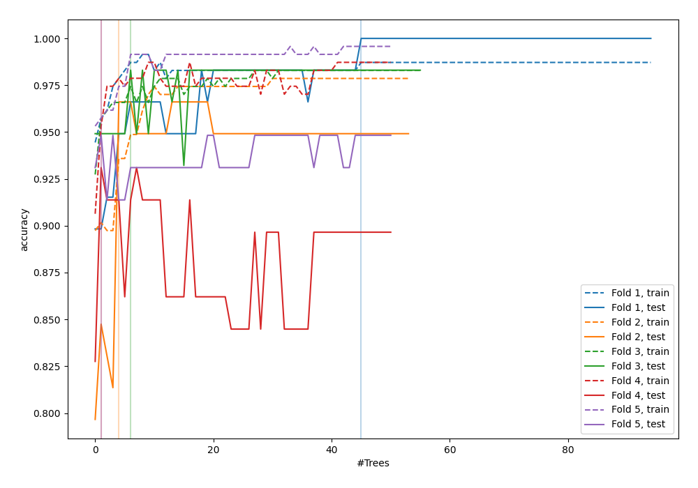
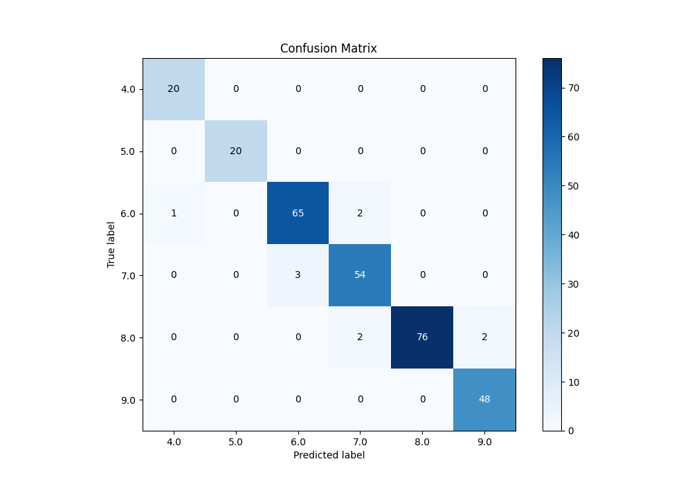
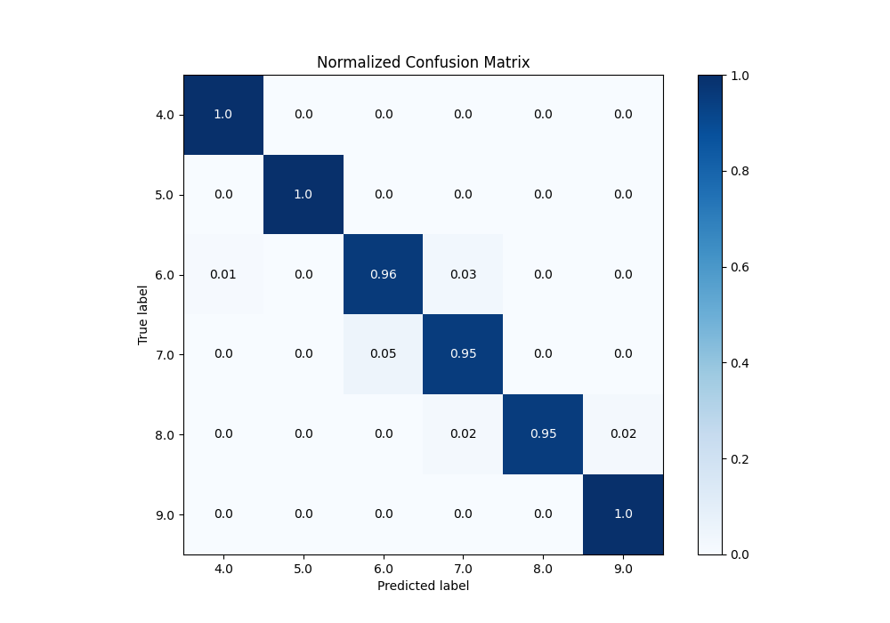
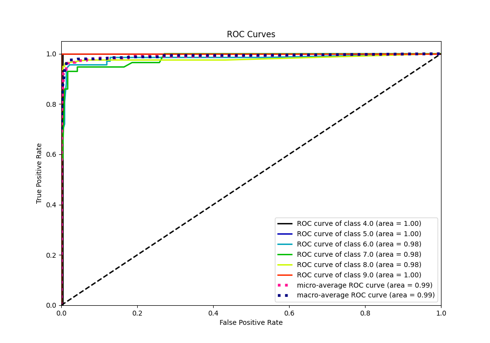
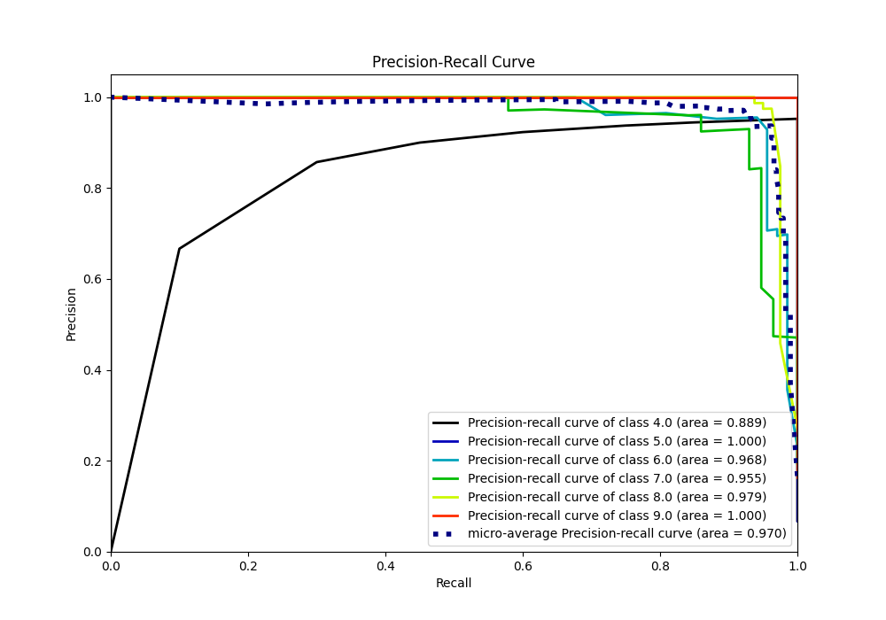

# Summary of 78_RandomForest_SelectedFeatures

[<< Go back](../README.md)

## Random Forest
- **n_jobs**: -1
- **criterion**: gini
- **max_features**: 0.6
- **min_samples_split**: 30
- **max_depth**: 7
- **eval_metric_name**: accuracy
- **num_class**: 6
- **explain_level**: 0

## Validation
 - **validation_type**: kfold
 - **k_folds**: 5

## Optimized metric
accuracy

## Training time

6.9 seconds

### Metric details
|           |       4.0 |   5.0 |       6.0 |       7.0 |       8.0 |       9.0 |   accuracy |   macro avg |   weighted avg |   logloss |
|:----------|----------:|------:|----------:|----------:|----------:|----------:|-----------:|------------:|---------------:|----------:|
| precision |  0.952381 |     1 |  0.955882 |  0.931034 |  1        |  0.96     |    0.96587 |    0.96655  |       0.966541 |  0.378797 |
| recall    |  1        |     1 |  0.955882 |  0.947368 |  0.95     |  1        |    0.96587 |    0.975542 |       0.96587  |  0.378797 |
| f1-score  |  0.97561  |     1 |  0.955882 |  0.93913  |  0.974359 |  0.979592 |    0.96587 |    0.970762 |       0.96591  |  0.378797 |
| support   | 20        |    20 | 68        | 57        | 80        | 48        |    0.96587 |  293        |     293        |  0.378797 |

## Confusion matrix
|                |   Predicted as 4.0 |   Predicted as 5.0 |   Predicted as 6.0 |   Predicted as 7.0 |   Predicted as 8.0 |   Predicted as 9.0 |
|:---------------|-------------------:|-------------------:|-------------------:|-------------------:|-------------------:|-------------------:|
| Labeled as 4.0 |                 20 |                  0 |                  0 |                  0 |                  0 |                  0 |
| Labeled as 5.0 |                  0 |                 20 |                  0 |                  0 |                  0 |                  0 |
| Labeled as 6.0 |                  1 |                  0 |                 65 |                  2 |                  0 |                  0 |
| Labeled as 7.0 |                  0 |                  0 |                  3 |                 54 |                  0 |                  0 |
| Labeled as 8.0 |                  0 |                  0 |                  0 |                  2 |                 76 |                  2 |
| Labeled as 9.0 |                  0 |                  0 |                  0 |                  0 |                  0 |                 48 |

## Learning curves

## Confusion Matrix

## Normalized Confusion Matrix

## ROC Curve

## Precision Recall Curve

[<< Go back](../README.md)
