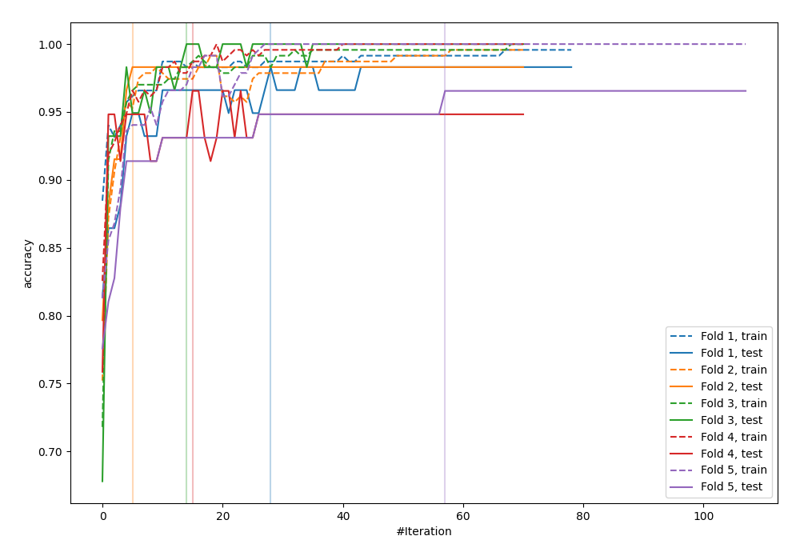
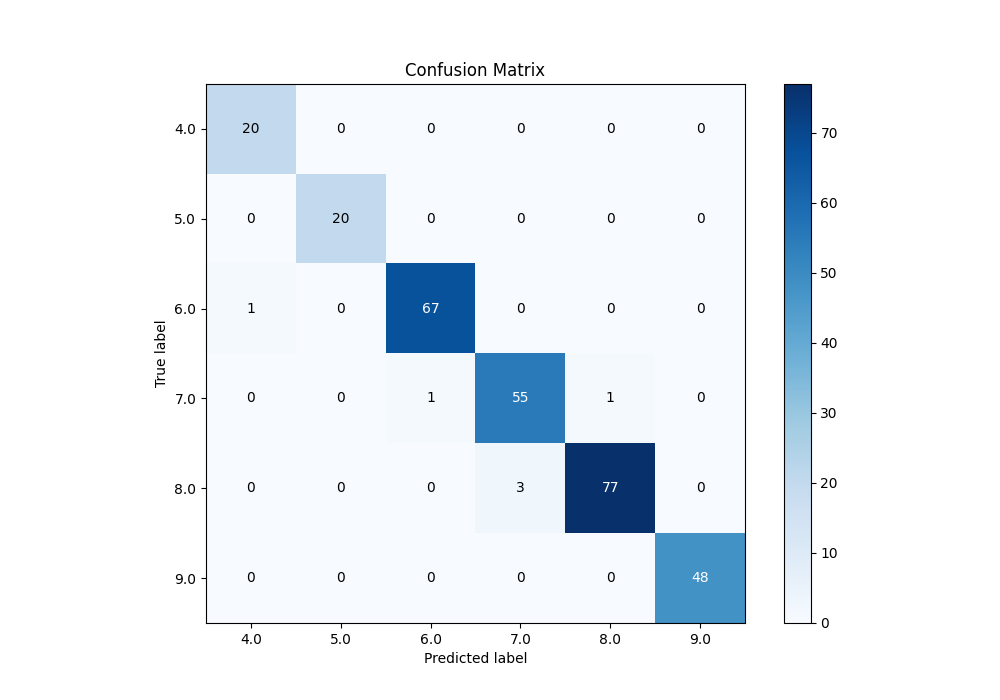
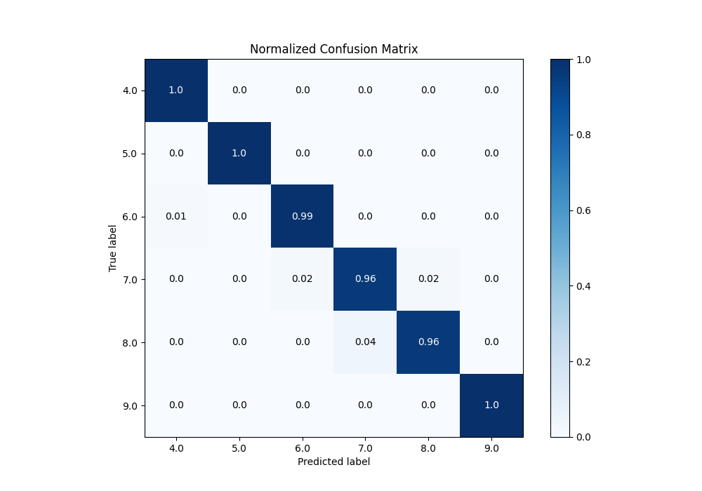
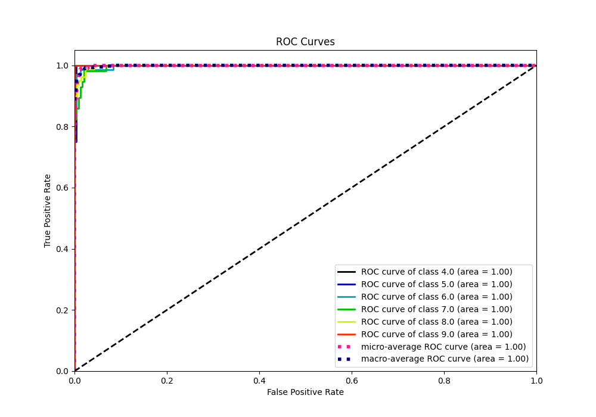
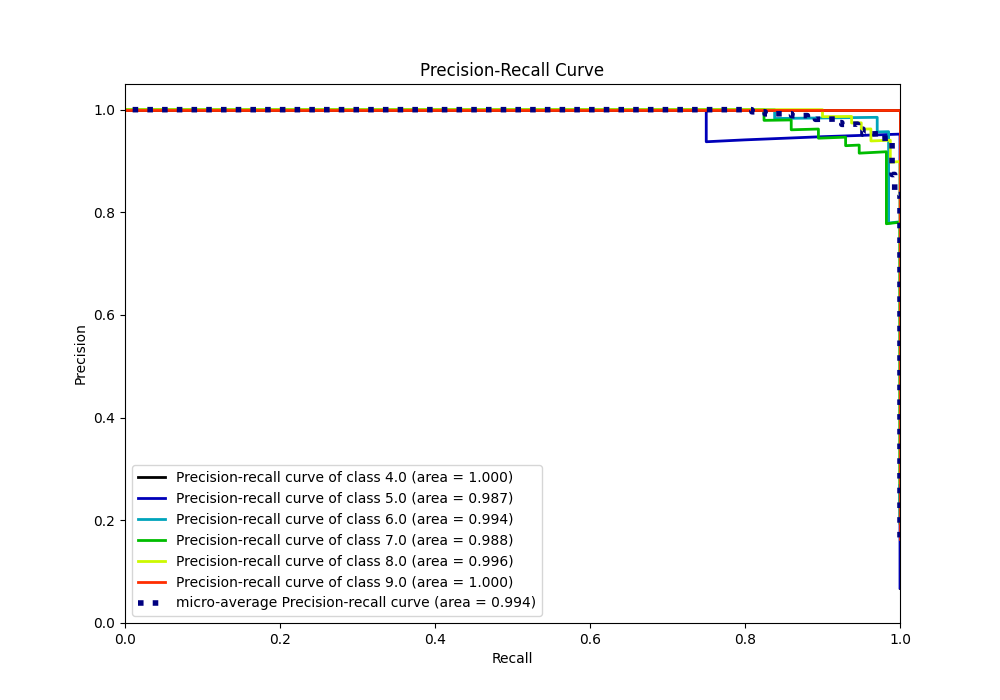

# Summary of 7_Default_CatBoost

[<< Go back](../README.md)

## CatBoost
- **n_jobs**: -1
- **learning_rate**: 0.15
- **depth**: 5
- **rsm**: 1
- **loss_function**: MultiClass
- **eval_metric**: Accuracy
- **num_class**: 6
- **explain_level**: 0

## Validation
 - **validation_type**: kfold
 - **k_folds**: 5

## Optimized metric
accuracy

## Training time

2.9 seconds

### Metric details
|           |       4.0 |   5.0 |       6.0 |       7.0 |       8.0 |   9.0 |   accuracy |   macro avg |   weighted avg |   logloss |
|:----------|----------:|------:|----------:|----------:|----------:|------:|-----------:|------------:|---------------:|----------:|
| precision |  0.952381 |     1 |  0.985294 |  0.948276 |  0.987179 |     1 |   0.979522 |    0.978855 |       0.979774 |   0.40455 |
| recall    |  1        |     1 |  0.985294 |  0.964912 |  0.9625   |     1 |   0.979522 |    0.985451 |       0.979522 |   0.40455 |
| f1-score  |  0.97561  |     1 |  0.985294 |  0.956522 |  0.974684 |     1 |   0.979522 |    0.982018 |       0.979552 |   0.40455 |
| support   | 20        |    20 | 68        | 57        | 80        |    48 |   0.979522 |  293        |     293        |   0.40455 |

## Confusion matrix
|                |   Predicted as 4.0 |   Predicted as 5.0 |   Predicted as 6.0 |   Predicted as 7.0 |   Predicted as 8.0 |   Predicted as 9.0 |
|:---------------|-------------------:|-------------------:|-------------------:|-------------------:|-------------------:|-------------------:|
| Labeled as 4.0 |                 20 |                  0 |                  0 |                  0 |                  0 |                  0 |
| Labeled as 5.0 |                  0 |                 20 |                  0 |                  0 |                  0 |                  0 |
| Labeled as 6.0 |                  1 |                  0 |                 67 |                  0 |                  0 |                  0 |
| Labeled as 7.0 |                  0 |                  0 |                  1 |                 55 |                  1 |                  0 |
| Labeled as 8.0 |                  0 |                  0 |                  0 |                  3 |                 77 |                  0 |
| Labeled as 9.0 |                  0 |                  0 |                  0 |                  0 |                  0 |                 48 |

## Learning curves

## Confusion Matrix

## Normalized Confusion Matrix

## ROC Curve

## Precision Recall Curve

[<< Go back](../README.md)
