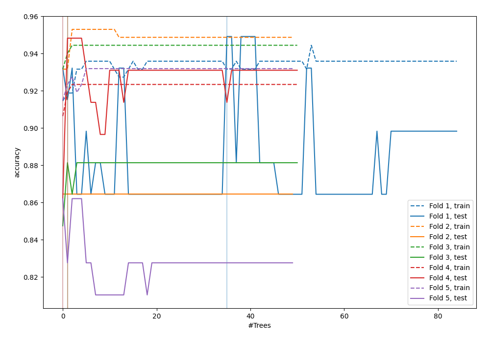
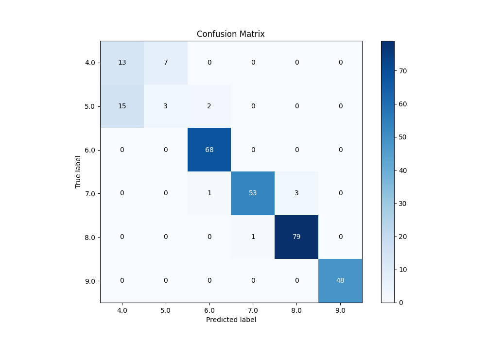
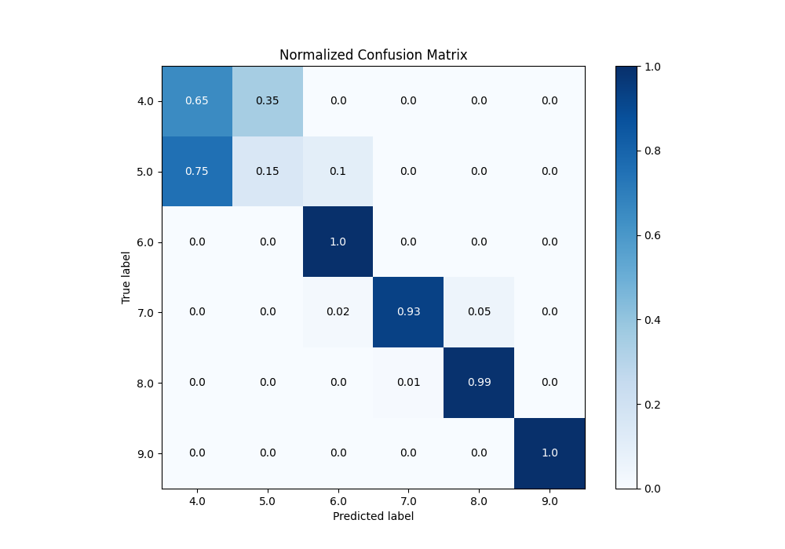
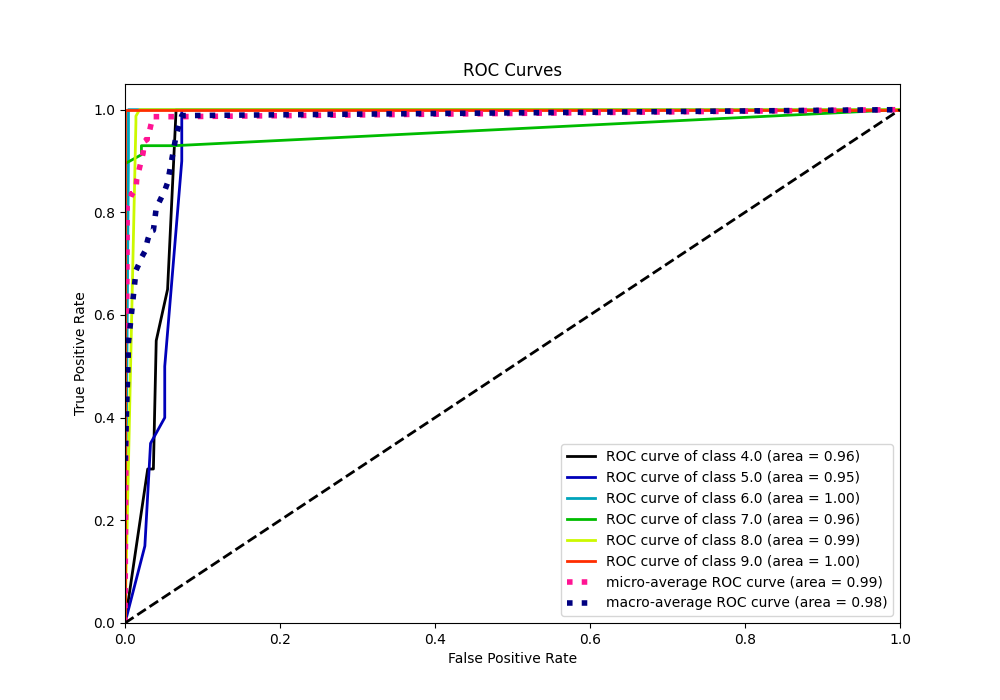
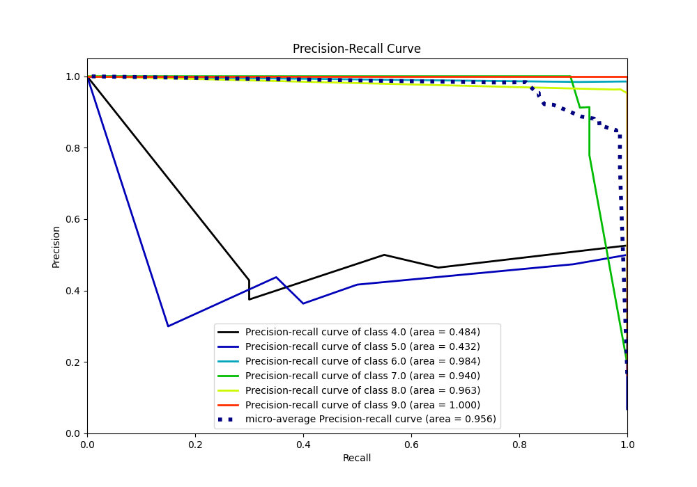

# Summary of 84_RandomForest_Stacked

[<< Go back](../README.md)

## Random Forest
- **n_jobs**: -1
- **criterion**: gini
- **max_features**: 0.6
- **min_samples_split**: 30
- **max_depth**: 7
- **eval_metric_name**: accuracy
- **num_class**: 6
- **explain_level**: 0

## Validation
 - **validation_type**: kfold
 - **k_folds**: 5

## Optimized metric
accuracy

## Training time

16.0 seconds

### Metric details
|           |       4.0 |   5.0 |       6.0 |       7.0 |       8.0 |   9.0 |   accuracy |   macro avg |   weighted avg |   logloss |
|:----------|----------:|------:|----------:|----------:|----------:|------:|-----------:|------------:|---------------:|----------:|
| precision |  0.464286 |  0.3  |  0.957746 |  0.981481 |  0.963415 |     1 |   0.901024 |    0.777821 |       0.892253 |  0.351177 |
| recall    |  0.65     |  0.15 |  1        |  0.929825 |  0.9875   |     1 |   0.901024 |    0.786221 |       0.901024 |  0.351177 |
| f1-score  |  0.541667 |  0.2  |  0.978417 |  0.954955 |  0.975309 |     1 |   0.901024 |    0.775058 |       0.893593 |  0.351177 |
| support   | 20        | 20    | 68        | 57        | 80        |    48 |   0.901024 |  293        |     293        |  0.351177 |

## Confusion matrix
|                |   Predicted as 4.0 |   Predicted as 5.0 |   Predicted as 6.0 |   Predicted as 7.0 |   Predicted as 8.0 |   Predicted as 9.0 |
|:---------------|-------------------:|-------------------:|-------------------:|-------------------:|-------------------:|-------------------:|
| Labeled as 4.0 |                 13 |                  7 |                  0 |                  0 |                  0 |                  0 |
| Labeled as 5.0 |                 15 |                  3 |                  2 |                  0 |                  0 |                  0 |
| Labeled as 6.0 |                  0 |                  0 |                 68 |                  0 |                  0 |                  0 |
| Labeled as 7.0 |                  0 |                  0 |                  1 |                 53 |                  3 |                  0 |
| Labeled as 8.0 |                  0 |                  0 |                  0 |                  1 |                 79 |                  0 |
| Labeled as 9.0 |                  0 |                  0 |                  0 |                  0 |                  0 |                 48 |

## Learning curves

## Confusion Matrix

## Normalized Confusion Matrix

## ROC Curve

## Precision Recall Curve

[<< Go back](../README.md)
