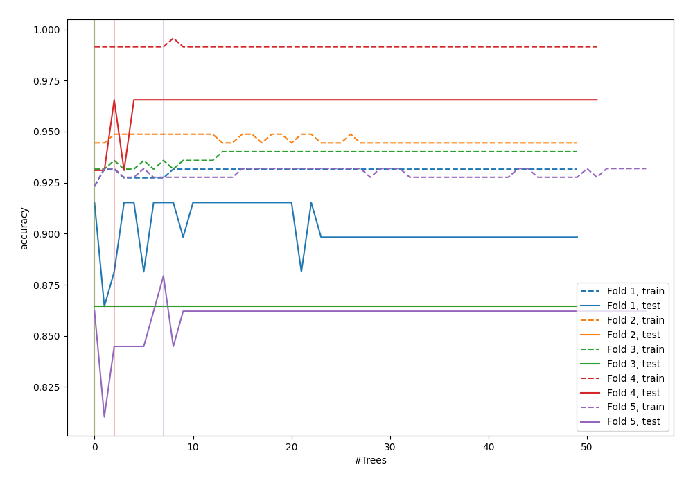
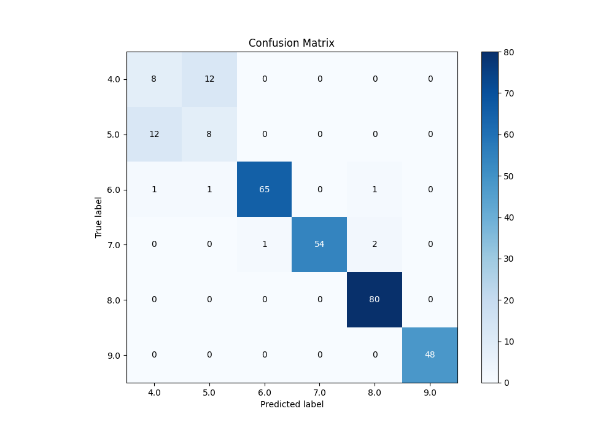
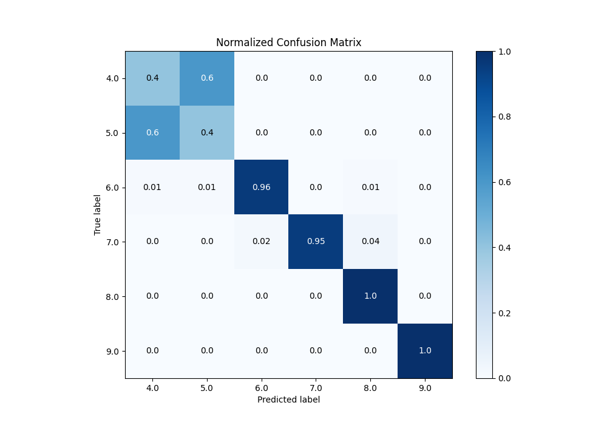
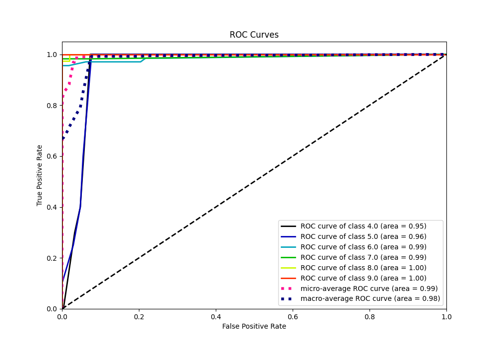
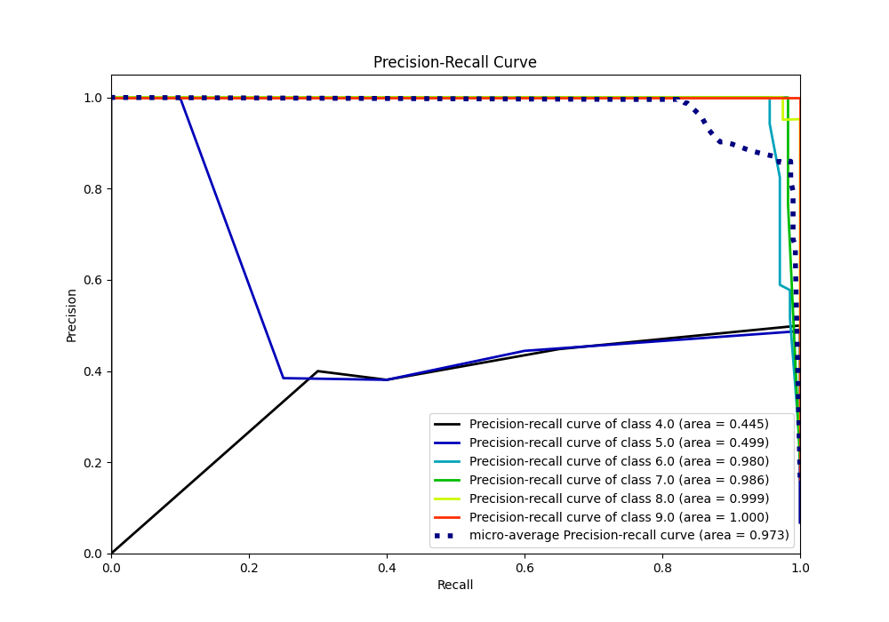

# Summary of 88_ExtraTrees_Stacked

[<< Go back](../README.md)

## Extra Trees Classifier (Extra Trees)
- **n_jobs**: -1
- **criterion**: gini
- **max_features**: 0.9
- **min_samples_split**: 40
- **max_depth**: 7
- **eval_metric_name**: accuracy
- **num_class**: 6
- **explain_level**: 0

## Validation
 - **validation_type**: kfold
 - **k_folds**: 5

## Optimized metric
accuracy

## Training time

14.6 seconds

### Metric details
|           |       4.0 |       5.0 |       6.0 |       7.0 |       8.0 |   9.0 |   accuracy |   macro avg |   weighted avg |   logloss |
|:----------|----------:|----------:|----------:|----------:|----------:|------:|-----------:|------------:|---------------:|----------:|
| precision |  0.380952 |  0.380952 |  0.984848 |  1        |  0.963855 |     1 |   0.897611 |    0.785101 |       0.902103 |  0.259515 |
| recall    |  0.4      |  0.4      |  0.955882 |  0.947368 |  1        |     1 |   0.897611 |    0.783875 |       0.897611 |  0.259515 |
| f1-score  |  0.390244 |  0.390244 |  0.970149 |  0.972973 |  0.981595 |     1 |   0.897611 |    0.784201 |       0.899546 |  0.259515 |
| support   | 20        | 20        | 68        | 57        | 80        |    48 |   0.897611 |  293        |     293        |  0.259515 |

## Confusion matrix
|                |   Predicted as 4.0 |   Predicted as 5.0 |   Predicted as 6.0 |   Predicted as 7.0 |   Predicted as 8.0 |   Predicted as 9.0 |
|:---------------|-------------------:|-------------------:|-------------------:|-------------------:|-------------------:|-------------------:|
| Labeled as 4.0 |                  8 |                 12 |                  0 |                  0 |                  0 |                  0 |
| Labeled as 5.0 |                 12 |                  8 |                  0 |                  0 |                  0 |                  0 |
| Labeled as 6.0 |                  1 |                  1 |                 65 |                  0 |                  1 |                  0 |
| Labeled as 7.0 |                  0 |                  0 |                  1 |                 54 |                  2 |                  0 |
| Labeled as 8.0 |                  0 |                  0 |                  0 |                  0 |                 80 |                  0 |
| Labeled as 9.0 |                  0 |                  0 |                  0 |                  0 |                  0 |                 48 |

## Learning curves

## Confusion Matrix

## Normalized Confusion Matrix

## ROC Curve

## Precision Recall Curve

[<< Go back](../README.md)
