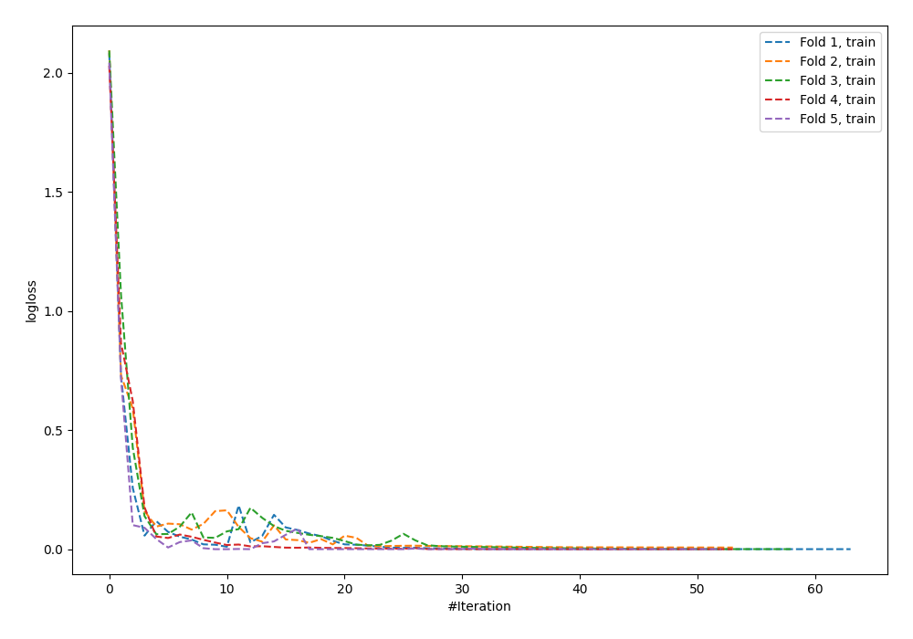
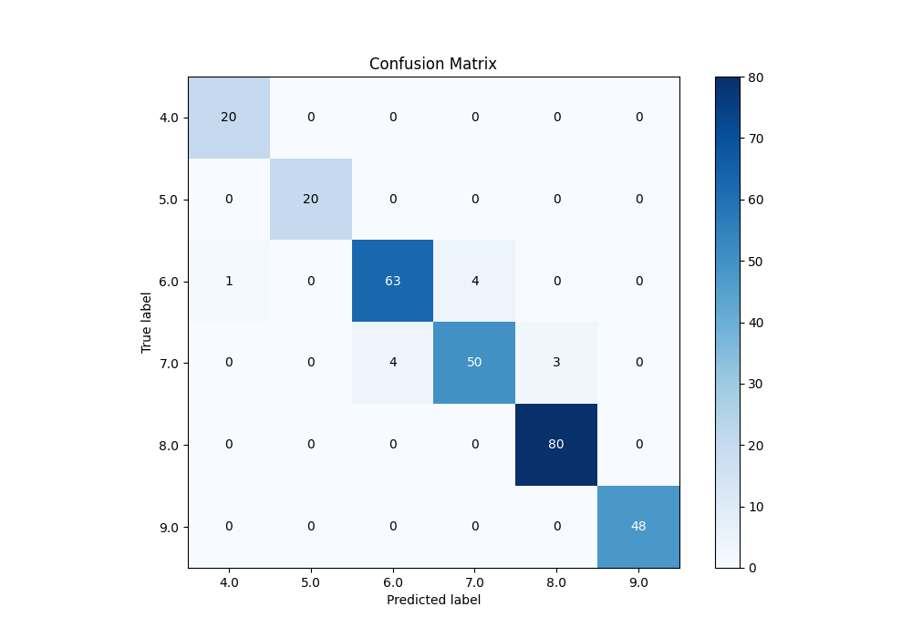
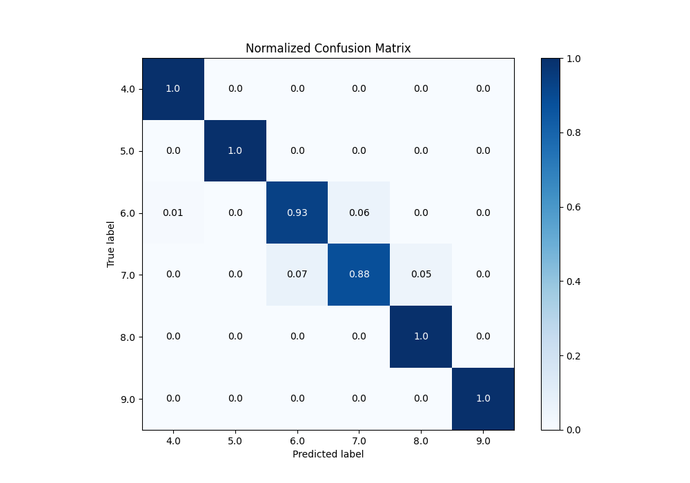
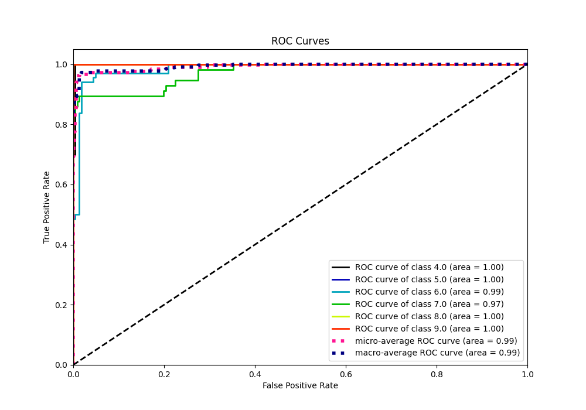
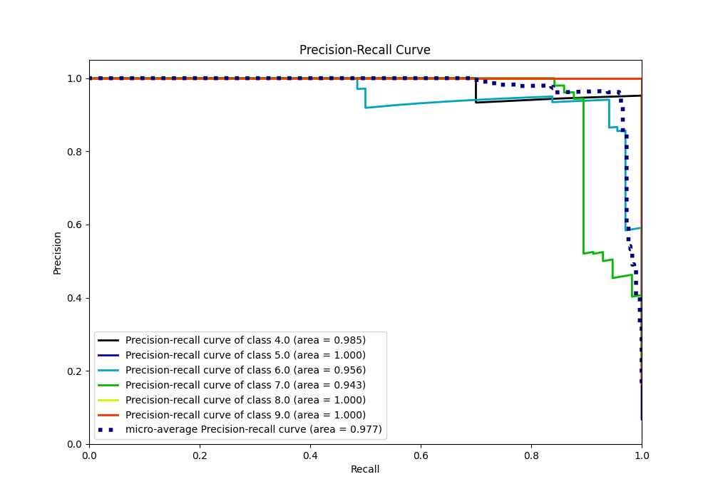

# Summary of 8_Default_NeuralNetwork_Stacked

[<< Go back](../README.md)

## Neural Network
- **n_jobs**: -1
- **dense_1_size**: 32
- **dense_2_size**: 16
- **learning_rate**: 0.05
- **num_class**: 6
- **explain_level**: 0

## Validation
 - **validation_type**: kfold
 - **k_folds**: 5

## Optimized metric
accuracy

## Training time

17.4 seconds

### Metric details
|           |       4.0 |   5.0 |       6.0 |       7.0 |       8.0 |   9.0 |   accuracy |   macro avg |   weighted avg |   logloss |
|:----------|----------:|------:|----------:|----------:|----------:|------:|-----------:|------------:|---------------:|----------:|
| precision |  0.952381 |     1 |  0.940299 |  0.925926 |  0.963855 |     1 |   0.959044 |    0.963743 |       0.958615 |  0.334562 |
| recall    |  1        |     1 |  0.926471 |  0.877193 |  1        |     1 |   0.959044 |    0.967277 |       0.959044 |  0.334562 |
| f1-score  |  0.97561  |     1 |  0.933333 |  0.900901 |  0.981595 |     1 |   0.959044 |    0.96524  |       0.958559 |  0.334562 |
| support   | 20        |    20 | 68        | 57        | 80        |    48 |   0.959044 |  293        |     293        |  0.334562 |

## Confusion matrix
|                |   Predicted as 4.0 |   Predicted as 5.0 |   Predicted as 6.0 |   Predicted as 7.0 |   Predicted as 8.0 |   Predicted as 9.0 |
|:---------------|-------------------:|-------------------:|-------------------:|-------------------:|-------------------:|-------------------:|
| Labeled as 4.0 |                 20 |                  0 |                  0 |                  0 |                  0 |                  0 |
| Labeled as 5.0 |                  0 |                 20 |                  0 |                  0 |                  0 |                  0 |
| Labeled as 6.0 |                  1 |                  0 |                 63 |                  4 |                  0 |                  0 |
| Labeled as 7.0 |                  0 |                  0 |                  4 |                 50 |                  3 |                  0 |
| Labeled as 8.0 |                  0 |                  0 |                  0 |                  0 |                 80 |                  0 |
| Labeled as 9.0 |                  0 |                  0 |                  0 |                  0 |                  0 |                 48 |

## Learning curves

## Confusion Matrix

## Normalized Confusion Matrix

## ROC Curve

## Precision Recall Curve

[<< Go back](../README.md)
