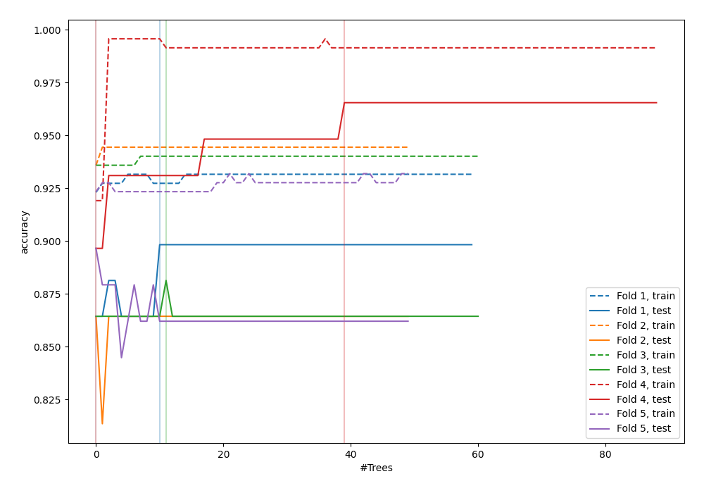
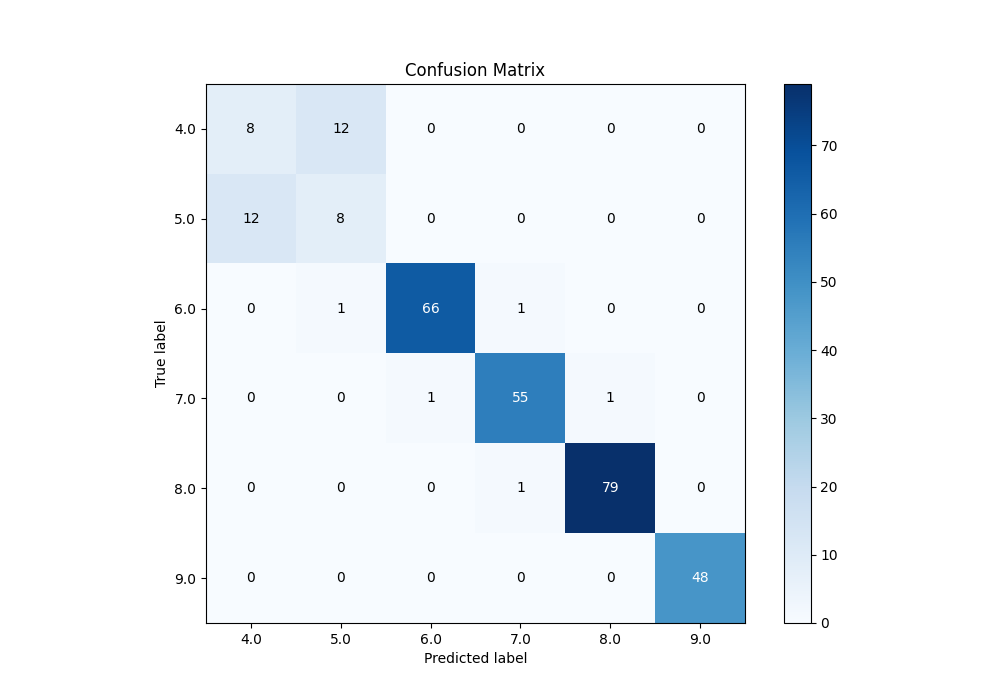
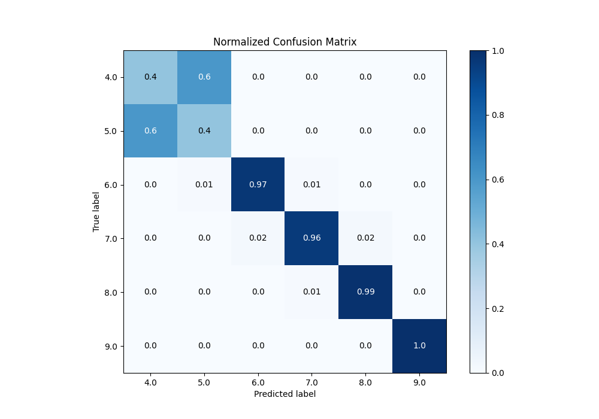
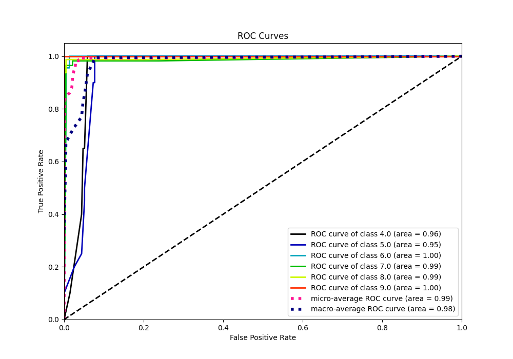
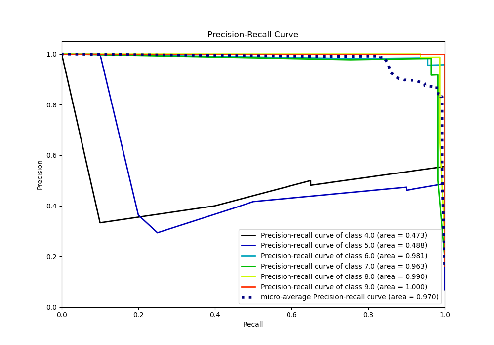

# Summary of 97_ExtraTrees_Stacked

[<< Go back](../README.md)

## Extra Trees Classifier (Extra Trees)
- **n_jobs**: -1
- **criterion**: gini
- **max_features**: 0.8
- **min_samples_split**: 40
- **max_depth**: 5
- **eval_metric_name**: accuracy
- **num_class**: 6
- **explain_level**: 0

## Validation
 - **validation_type**: kfold
 - **k_folds**: 5

## Optimized metric
accuracy

## Training time

20.0 seconds

### Metric details
|           |   4.0 |       5.0 |       6.0 |       7.0 |     8.0 |   9.0 |   accuracy |   macro avg |   weighted avg |   logloss |
|:----------|------:|----------:|----------:|----------:|--------:|------:|-----------:|------------:|---------------:|----------:|
| precision |   0.4 |  0.380952 |  0.985075 |  0.964912 |  0.9875 |     1 |   0.901024 |    0.786407 |       0.903086 |  0.263787 |
| recall    |   0.4 |  0.4      |  0.970588 |  0.964912 |  0.9875 |     1 |   0.901024 |    0.787167 |       0.901024 |  0.263787 |
| f1-score  |   0.4 |  0.390244 |  0.977778 |  0.964912 |  0.9875 |     1 |   0.901024 |    0.786739 |       0.902027 |  0.263787 |
| support   |  20   | 20        | 68        | 57        | 80      |    48 |   0.901024 |  293        |     293        |  0.263787 |

## Confusion matrix
|                |   Predicted as 4.0 |   Predicted as 5.0 |   Predicted as 6.0 |   Predicted as 7.0 |   Predicted as 8.0 |   Predicted as 9.0 |
|:---------------|-------------------:|-------------------:|-------------------:|-------------------:|-------------------:|-------------------:|
| Labeled as 4.0 |                  8 |                 12 |                  0 |                  0 |                  0 |                  0 |
| Labeled as 5.0 |                 12 |                  8 |                  0 |                  0 |                  0 |                  0 |
| Labeled as 6.0 |                  0 |                  1 |                 66 |                  1 |                  0 |                  0 |
| Labeled as 7.0 |                  0 |                  0 |                  1 |                 55 |                  1 |                  0 |
| Labeled as 8.0 |                  0 |                  0 |                  0 |                  1 |                 79 |                  0 |
| Labeled as 9.0 |                  0 |                  0 |                  0 |                  0 |                  0 |                 48 |

## Learning curves

## Confusion Matrix

## Normalized Confusion Matrix

## ROC Curve

## Precision Recall Curve

[<< Go back](../README.md)
