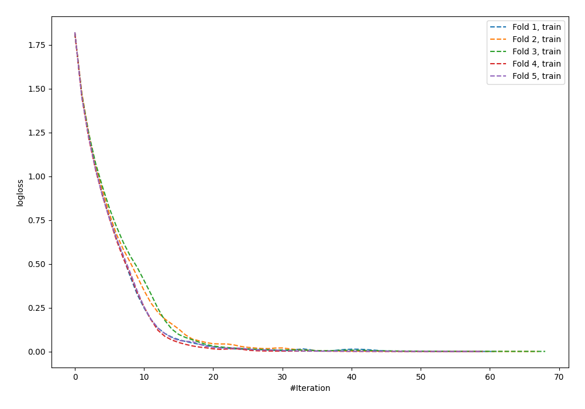
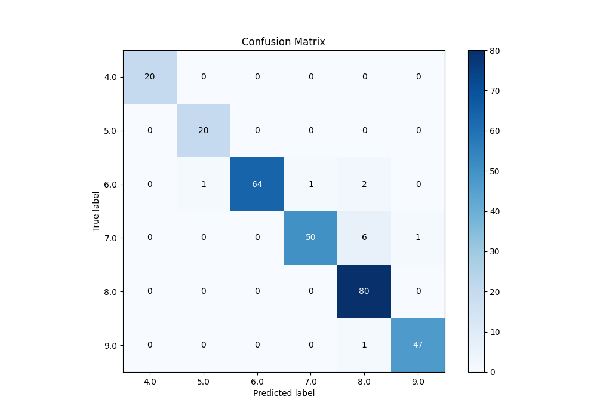
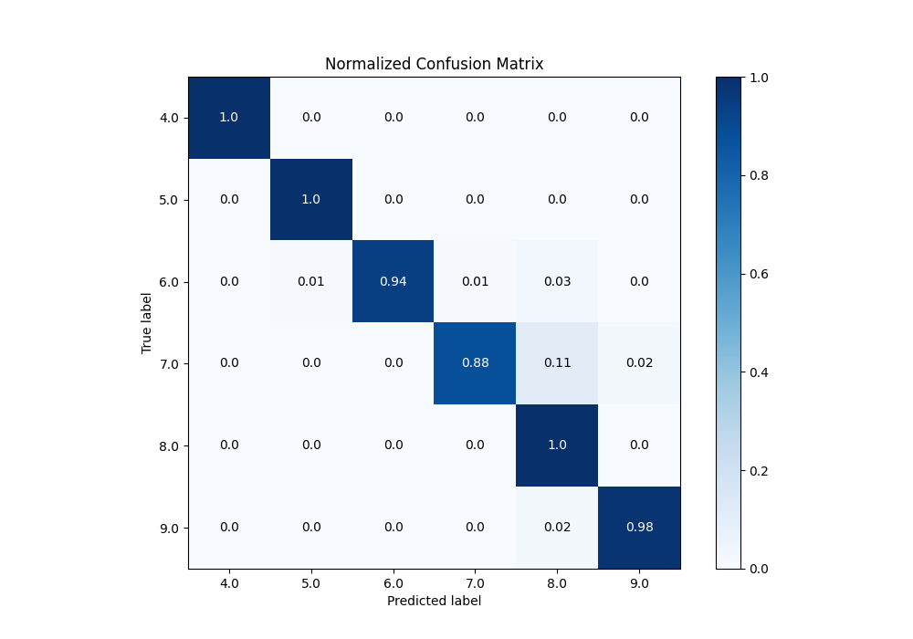
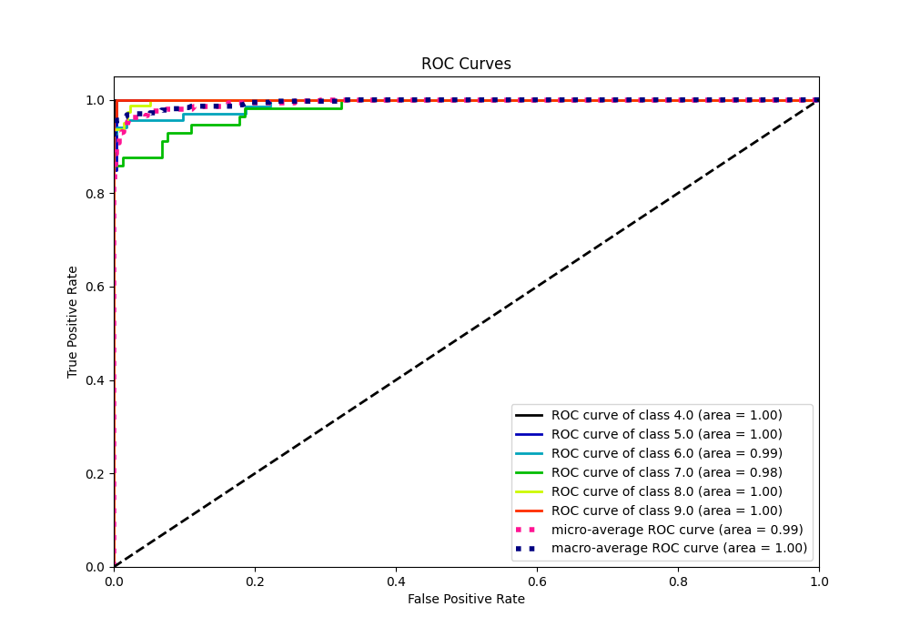
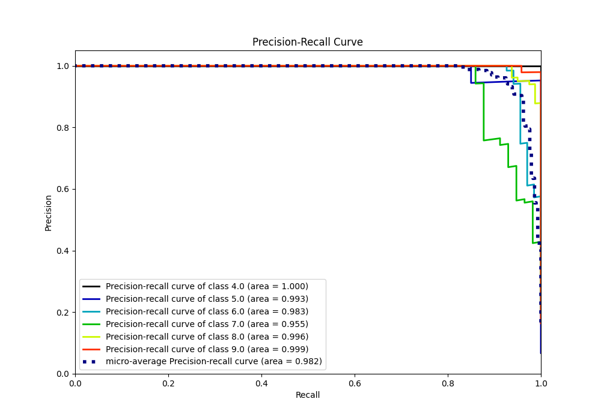

# Summary of 99_NeuralNetwork

[<< Go back](../README.md)

## Neural Network
- **n_jobs**: -1
- **dense_1_size**: 64
- **dense_2_size**: 8
- **learning_rate**: 0.01
- **num_class**: 6
- **explain_level**: 0

## Validation
 - **validation_type**: kfold
 - **k_folds**: 5

## Optimized metric
accuracy

## Training time

7.1 seconds

### Metric details
|           |   4.0 |       5.0 |       6.0 |       7.0 |       8.0 |       9.0 |   accuracy |   macro avg |   weighted avg |   logloss |
|:----------|------:|----------:|----------:|----------:|----------:|----------:|-----------:|------------:|---------------:|----------:|
| precision |     1 |  0.952381 |  1        |  0.980392 |  0.898876 |  0.979167 |   0.959044 |    0.968469 |       0.961912 |  0.281661 |
| recall    |     1 |  1        |  0.941176 |  0.877193 |  1        |  0.979167 |   0.959044 |    0.966256 |       0.959044 |  0.281661 |
| f1-score  |     1 |  0.97561  |  0.969697 |  0.925926 |  0.946746 |  0.979167 |   0.959044 |    0.966191 |       0.958939 |  0.281661 |
| support   |    20 | 20        | 68        | 57        | 80        | 48        |   0.959044 |  293        |     293        |  0.281661 |

## Confusion matrix
|                |   Predicted as 4.0 |   Predicted as 5.0 |   Predicted as 6.0 |   Predicted as 7.0 |   Predicted as 8.0 |   Predicted as 9.0 |
|:---------------|-------------------:|-------------------:|-------------------:|-------------------:|-------------------:|-------------------:|
| Labeled as 4.0 |                 20 |                  0 |                  0 |                  0 |                  0 |                  0 |
| Labeled as 5.0 |                  0 |                 20 |                  0 |                  0 |                  0 |                  0 |
| Labeled as 6.0 |                  0 |                  1 |                 64 |                  1 |                  2 |                  0 |
| Labeled as 7.0 |                  0 |                  0 |                  0 |                 50 |                  6 |                  1 |
| Labeled as 8.0 |                  0 |                  0 |                  0 |                  0 |                 80 |                  0 |
| Labeled as 9.0 |                  0 |                  0 |                  0 |                  0 |                  1 |                 47 |

## Learning curves

## Confusion Matrix

## Normalized Confusion Matrix

## ROC Curve

## Precision Recall Curve

[<< Go back](../README.md)
