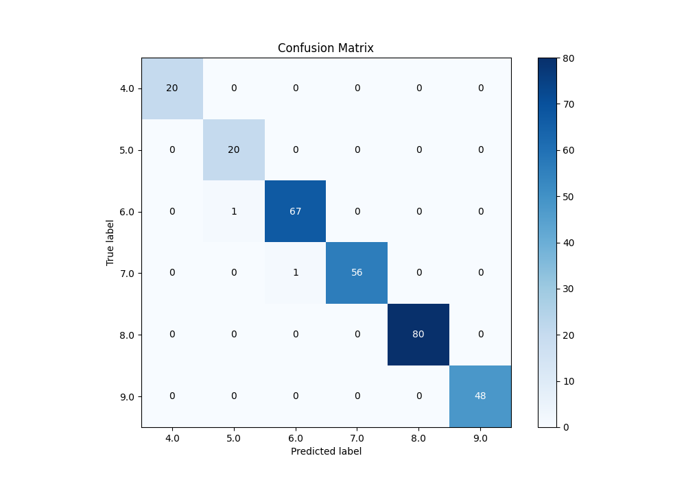

# Summary of Ensemble

[<< Go back](../README.md)

## Ensemble structure
| Model       |   Weight |
|:------------|---------:|
| 75_CatBoost |        1 |

### Metric details
|           |   4.0 |       5.0 |       6.0 |       7.0 |   8.0 |   9.0 |   accuracy |   macro avg |   weighted avg |   logloss |
|:----------|------:|----------:|----------:|----------:|------:|------:|-----------:|------------:|---------------:|----------:|
| precision |     1 |  0.952381 |  0.985294 |  1        |     1 |     1 |   0.993174 |    0.989613 |       0.993337 |  0.333501 |
| recall    |     1 |  1        |  0.985294 |  0.982456 |     1 |     1 |   0.993174 |    0.994625 |       0.993174 |  0.333501 |
| f1-score  |     1 |  0.97561  |  0.985294 |  0.99115  |     1 |     1 |   0.993174 |    0.992009 |       0.993201 |  0.333501 |
| support   |    20 | 20        | 68        | 57        |    80 |    48 |   0.993174 |  293        |     293        |  0.333501 |

## Confusion matrix
|                |   Predicted as 4.0 |   Predicted as 5.0 |   Predicted as 6.0 |   Predicted as 7.0 |   Predicted as 8.0 |   Predicted as 9.0 |
|:---------------|-------------------:|-------------------:|-------------------:|-------------------:|-------------------:|-------------------:|
| Labeled as 4.0 |                 20 |                  0 |                  0 |                  0 |                  0 |                  0 |
| Labeled as 5.0 |                  0 |                 20 |                  0 |                  0 |                  0 |                  0 |
| Labeled as 6.0 |                  0 |                  1 |                 67 |                  0 |                  0 |                  0 |
| Labeled as 7.0 |                  0 |                  0 |                  1 |                 56 |                  0 |                  0 |
| Labeled as 8.0 |                  0 |                  0 |                  0 |                  0 |                 80 |                  0 |
| Labeled as 9.0 |                  0 |                  0 |                  0 |                  0 |                  0 |                 48 |

## Learning curves

## Confusion Matrix

## Normalized Confusion Matrix

## ROC Curve

## Precision Recall Curve

[<< Go back](../README.md)
