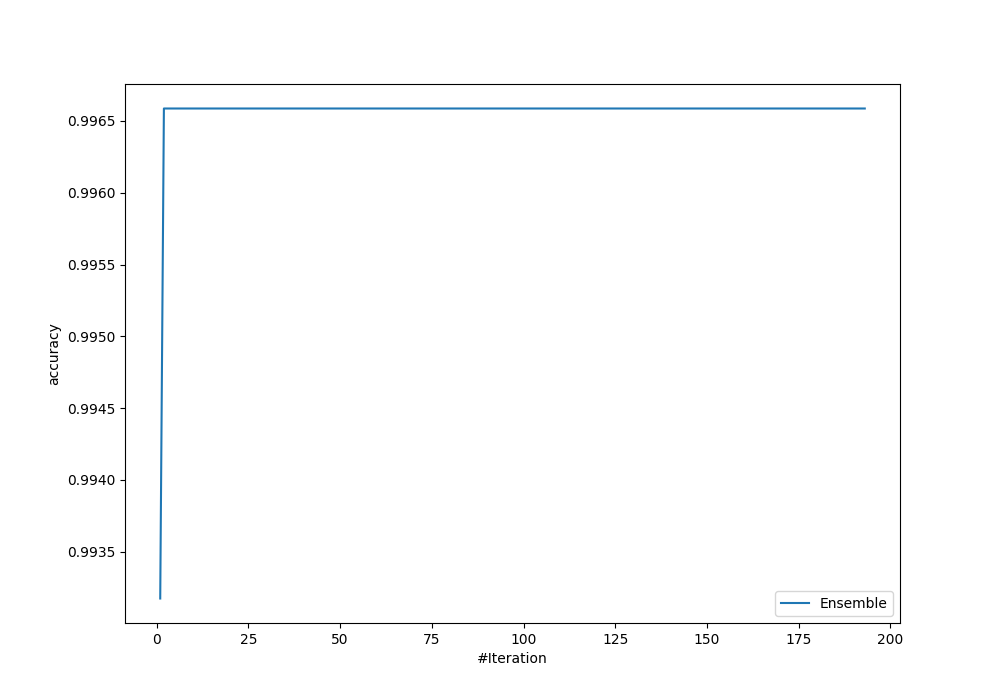
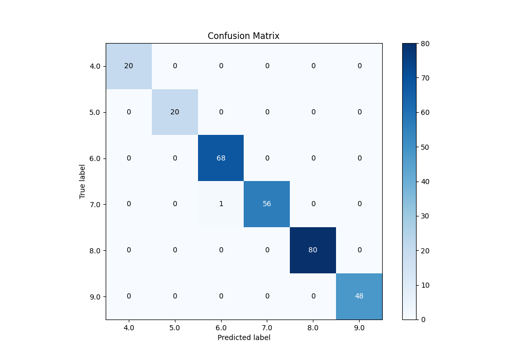
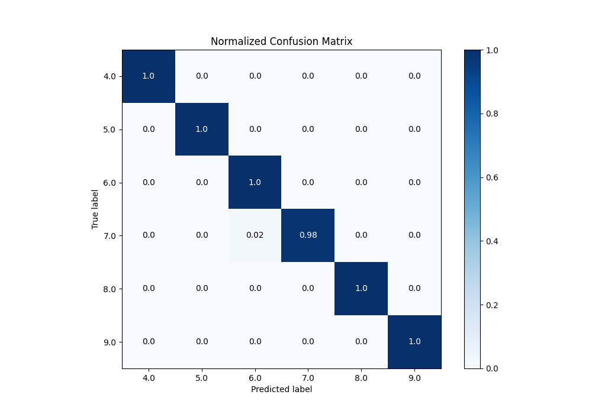
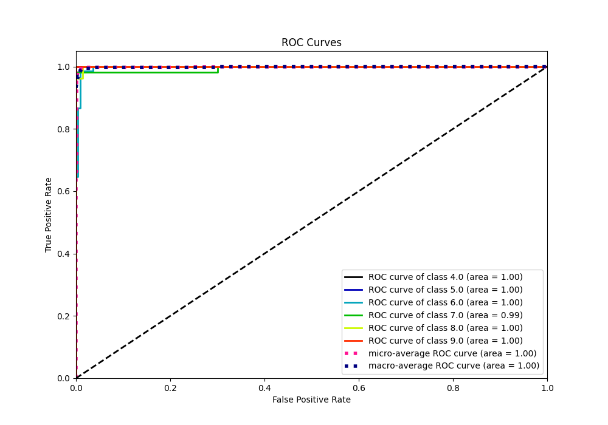
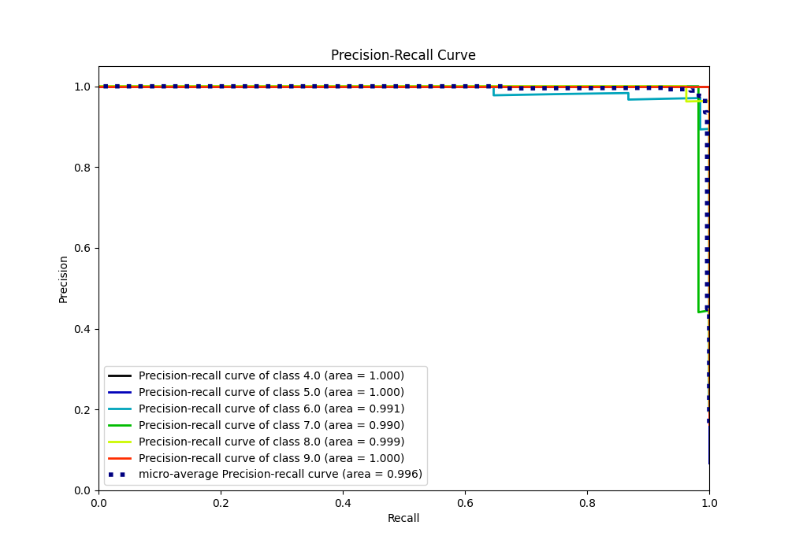

# Summary of Ensemble_Stacked

[<< Go back](../README.md)

## Ensemble structure
| Model              |   Weight |
|:-------------------|---------:|
| 75_CatBoost        |        1 |
| 92_Xgboost_Stacked |        1 |

### Metric details
|           |   4.0 |   5.0 |       6.0 |       7.0 |   8.0 |   9.0 |   accuracy |   macro avg |   weighted avg |   logloss |
|:----------|------:|------:|----------:|----------:|------:|------:|-----------:|------------:|---------------:|----------:|
| precision |     1 |     1 |  0.985507 |  1        |     1 |     1 |   0.996587 |    0.997585 |       0.996636 |  0.765395 |
| recall    |     1 |     1 |  1        |  0.982456 |     1 |     1 |   0.996587 |    0.997076 |       0.996587 |  0.765395 |
| f1-score  |     1 |     1 |  0.992701 |  0.99115  |     1 |     1 |   0.996587 |    0.997309 |       0.996584 |  0.765395 |
| support   |    20 |    20 | 68        | 57        |    80 |    48 |   0.996587 |  293        |     293        |  0.765395 |

## Confusion matrix
|                |   Predicted as 4.0 |   Predicted as 5.0 |   Predicted as 6.0 |   Predicted as 7.0 |   Predicted as 8.0 |   Predicted as 9.0 |
|:---------------|-------------------:|-------------------:|-------------------:|-------------------:|-------------------:|-------------------:|
| Labeled as 4.0 |                 20 |                  0 |                  0 |                  0 |                  0 |                  0 |
| Labeled as 5.0 |                  0 |                 20 |                  0 |                  0 |                  0 |                  0 |
| Labeled as 6.0 |                  0 |                  0 |                 68 |                  0 |                  0 |                  0 |
| Labeled as 7.0 |                  0 |                  0 |                  1 |                 56 |                  0 |                  0 |
| Labeled as 8.0 |                  0 |                  0 |                  0 |                  0 |                 80 |                  0 |
| Labeled as 9.0 |                  0 |                  0 |                  0 |                  0 |                  0 |                 48 |

## Learning curves

## Confusion Matrix

## Normalized Confusion Matrix

## ROC Curve

## Precision Recall Curve

[<< Go back](../README.md)
