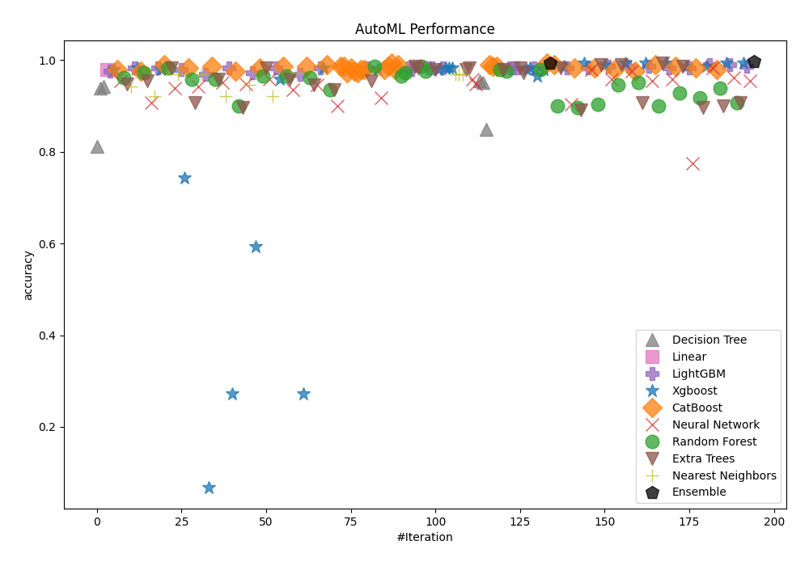
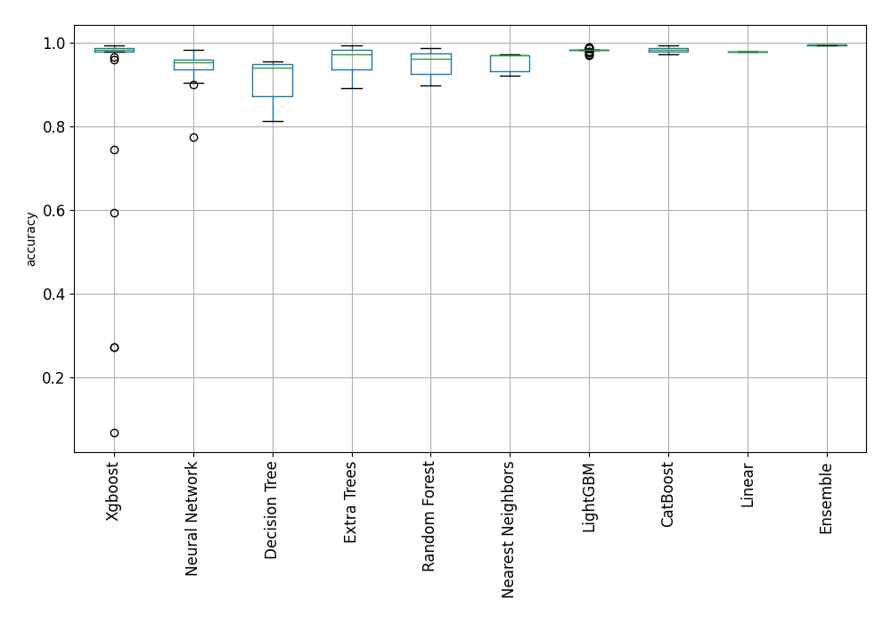
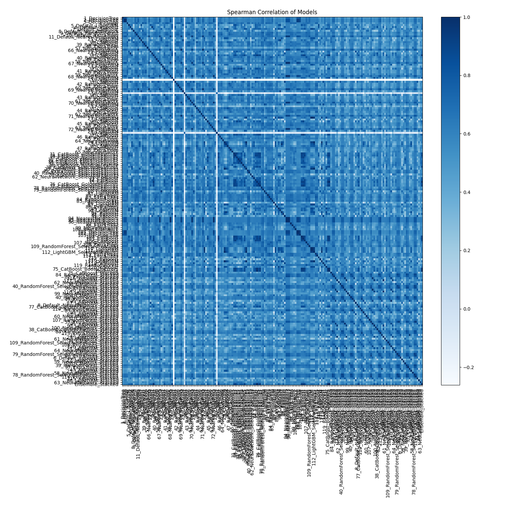

# AutoML Leaderboard

| Best model   | name                                                                                             | model_type        | metric_type   |   metric_value |   train_time |
|:-------------|:-------------------------------------------------------------------------------------------------|:------------------|:--------------|---------------:|-------------:|
|              | [1_DecisionTree](1_DecisionTree/README.md)                                                       | Decision Tree     | accuracy      |      0.812287  |         3.21 |
|              | [2_DecisionTree](2_DecisionTree/README.md)                                                       | Decision Tree     | accuracy      |      0.938567  |         2.73 |
|              | [3_DecisionTree](3_DecisionTree/README.md)                                                       | Decision Tree     | accuracy      |      0.94198   |         2.86 |
|              | [4_Linear](4_Linear/README.md)                                                                   | Linear            | accuracy      |      0.979522  |         4.01 |
|              | [5_Default_LightGBM](5_Default_LightGBM/README.md)                                               | LightGBM          | accuracy      |      0.976109  |         4.11 |
|              | [6_Default_Xgboost](6_Default_Xgboost/README.md)                                                 | Xgboost           | accuracy      |      0.979522  |         4.82 |
|              | [7_Default_CatBoost](7_Default_CatBoost/README.md)                                               | CatBoost          | accuracy      |      0.979522  |         3.46 |
|              | [8_Default_NeuralNetwork](8_Default_NeuralNetwork/README.md)                                     | Neural Network    | accuracy      |      0.955631  |         5.83 |
|              | [9_Default_RandomForest](9_Default_RandomForest/README.md)                                       | Random Forest     | accuracy      |      0.962457  |         4.26 |
|              | [10_Default_ExtraTrees](10_Default_ExtraTrees/README.md)                                         | Extra Trees       | accuracy      |      0.948805  |         4.27 |
|              | [11_Default_NearestNeighbors](11_Default_NearestNeighbors/README.md)                             | Nearest Neighbors | accuracy      |      0.94198   |         3.23 |
|              | [21_LightGBM](21_LightGBM/README.md)                                                             | LightGBM          | accuracy      |      0.982935  |         3.93 |
|              | [12_Xgboost](12_Xgboost/README.md)                                                               | Xgboost           | accuracy      |      0.982935  |         5.17 |
|              | [30_CatBoost](30_CatBoost/README.md)                                                             | CatBoost          | accuracy      |      0.976109  |         3.45 |
|              | [39_RandomForest](39_RandomForest/README.md)                                                     | Random Forest     | accuracy      |      0.972696  |         4.65 |
|              | [48_ExtraTrees](48_ExtraTrees/README.md)                                                         | Extra Trees       | accuracy      |      0.955631  |         4.48 |
|              | [57_NeuralNetwork](57_NeuralNetwork/README.md)                                                   | Neural Network    | accuracy      |      0.90785   |         4.39 |
|              | [66_NearestNeighbors](66_NearestNeighbors/README.md)                                             | Nearest Neighbors | accuracy      |      0.921502  |         3.43 |
|              | [22_LightGBM](22_LightGBM/README.md)                                                             | LightGBM          | accuracy      |      0.982935  |         3.94 |
|              | [13_Xgboost](13_Xgboost/README.md)                                                               | Xgboost           | accuracy      |      0.979522  |         4.01 |
|              | [31_CatBoost](31_CatBoost/README.md)                                                             | CatBoost          | accuracy      |      0.989761  |         3.71 |
|              | [40_RandomForest](40_RandomForest/README.md)                                                     | Random Forest     | accuracy      |      0.982935  |         4.93 |
|              | [49_ExtraTrees](49_ExtraTrees/README.md)                                                         | Extra Trees       | accuracy      |      0.982935  |         4.64 |
|              | [58_NeuralNetwork](58_NeuralNetwork/README.md)                                                   | Neural Network    | accuracy      |      0.938567  |         4.41 |
|              | [67_NearestNeighbors](67_NearestNeighbors/README.md)                                             | Nearest Neighbors | accuracy      |      0.969283  |         3.68 |
|              | [23_LightGBM](23_LightGBM/README.md)                                                             | LightGBM          | accuracy      |      0.979522  |         4.7  |
|              | [14_Xgboost](14_Xgboost/README.md)                                                               | Xgboost           | accuracy      |      0.744027  |         4.42 |
|              | [32_CatBoost](32_CatBoost/README.md)                                                             | CatBoost          | accuracy      |      0.982935  |         4.07 |
|              | [41_RandomForest](41_RandomForest/README.md)                                                     | Random Forest     | accuracy      |      0.959044  |         5.2  |
|              | [50_ExtraTrees](50_ExtraTrees/README.md)                                                         | Extra Trees       | accuracy      |      0.90785   |         5.08 |
|              | [59_NeuralNetwork](59_NeuralNetwork/README.md)                                                   | Neural Network    | accuracy      |      0.94198   |         4.95 |
|              | [68_NearestNeighbors](68_NearestNeighbors/README.md)                                             | Nearest Neighbors | accuracy      |      0.969283  |         4.13 |
|              | [24_LightGBM](24_LightGBM/README.md)                                                             | LightGBM          | accuracy      |      0.969283  |         6.43 |
|              | [15_Xgboost](15_Xgboost/README.md)                                                               | Xgboost           | accuracy      |      0.0682594 |         5.74 |
|              | [33_CatBoost](33_CatBoost/README.md)                                                             | CatBoost          | accuracy      |      0.986348  |         4.72 |
|              | [42_RandomForest](42_RandomForest/README.md)                                                     | Random Forest     | accuracy      |      0.959044  |         5.4  |
|              | [51_ExtraTrees](51_ExtraTrees/README.md)                                                         | Extra Trees       | accuracy      |      0.959044  |         5.44 |
|              | [60_NeuralNetwork](60_NeuralNetwork/README.md)                                                   | Neural Network    | accuracy      |      0.952218  |         5.05 |
|              | [69_NearestNeighbors](69_NearestNeighbors/README.md)                                             | Nearest Neighbors | accuracy      |      0.921502  |         4.4  |
|              | [25_LightGBM](25_LightGBM/README.md)                                                             | LightGBM          | accuracy      |      0.982935  |         4.95 |
|              | [16_Xgboost](16_Xgboost/README.md)                                                               | Xgboost           | accuracy      |      0.273038  |         4.38 |
|              | [34_CatBoost](34_CatBoost/README.md)                                                             | CatBoost          | accuracy      |      0.976109  |         4.48 |
|              | [43_RandomForest](43_RandomForest/README.md)                                                     | Random Forest     | accuracy      |      0.901024  |         5.75 |
|              | [52_ExtraTrees](52_ExtraTrees/README.md)                                                         | Extra Trees       | accuracy      |      0.897611  |         5.66 |
|              | [61_NeuralNetwork](61_NeuralNetwork/README.md)                                                   | Neural Network    | accuracy      |      0.948805  |         5.02 |
|              | [70_NearestNeighbors](70_NearestNeighbors/README.md)                                             | Nearest Neighbors | accuracy      |      0.945392  |         4.39 |
|              | [26_LightGBM](26_LightGBM/README.md)                                                             | LightGBM          | accuracy      |      0.972696  |         6.02 |
|              | [17_Xgboost](17_Xgboost/README.md)                                                               | Xgboost           | accuracy      |      0.593857  |         5.77 |
|              | [35_CatBoost](35_CatBoost/README.md)                                                             | CatBoost          | accuracy      |      0.982935  |         5.15 |
|              | [44_RandomForest](44_RandomForest/README.md)                                                     | Random Forest     | accuracy      |      0.96587   |         5.69 |
|              | [53_ExtraTrees](53_ExtraTrees/README.md)                                                         | Extra Trees       | accuracy      |      0.982935  |         5.88 |
|              | [62_NeuralNetwork](62_NeuralNetwork/README.md)                                                   | Neural Network    | accuracy      |      0.959044  |         6.17 |
|              | [71_NearestNeighbors](71_NearestNeighbors/README.md)                                             | Nearest Neighbors | accuracy      |      0.921502  |         5.08 |
|              | [27_LightGBM](27_LightGBM/README.md)                                                             | LightGBM          | accuracy      |      0.982935  |         6.07 |
|              | [18_Xgboost](18_Xgboost/README.md)                                                               | Xgboost           | accuracy      |      0.959044  |         5.68 |
|              | [36_CatBoost](36_CatBoost/README.md)                                                             | CatBoost          | accuracy      |      0.986348  |         5.37 |
|              | [45_RandomForest](45_RandomForest/README.md)                                                     | Random Forest     | accuracy      |      0.96587   |         6.37 |
|              | [54_ExtraTrees](54_ExtraTrees/README.md)                                                         | Extra Trees       | accuracy      |      0.959044  |         6.05 |
|              | [63_NeuralNetwork](63_NeuralNetwork/README.md)                                                   | Neural Network    | accuracy      |      0.935154  |         5.37 |
|              | [72_NearestNeighbors](72_NearestNeighbors/README.md)                                             | Nearest Neighbors | accuracy      |      0.972696  |         5.33 |
|              | [28_LightGBM](28_LightGBM/README.md)                                                             | LightGBM          | accuracy      |      0.969283  |         6.57 |
|              | [19_Xgboost](19_Xgboost/README.md)                                                               | Xgboost           | accuracy      |      0.273038  |         5.05 |
|              | [37_CatBoost](37_CatBoost/README.md)                                                             | CatBoost          | accuracy      |      0.986348  |         4.88 |
|              | [46_RandomForest](46_RandomForest/README.md)                                                     | Random Forest     | accuracy      |      0.962457  |         6.44 |
|              | [55_ExtraTrees](55_ExtraTrees/README.md)                                                         | Extra Trees       | accuracy      |      0.945392  |         6.06 |
|              | [64_NeuralNetwork](64_NeuralNetwork/README.md)                                                   | Neural Network    | accuracy      |      0.945392  |         5.82 |
|              | [29_LightGBM](29_LightGBM/README.md)                                                             | LightGBM          | accuracy      |      0.982935  |         6.11 |
|              | [20_Xgboost](20_Xgboost/README.md)                                                               | Xgboost           | accuracy      |      0.982935  |         5.73 |
|              | [38_CatBoost](38_CatBoost/README.md)                                                             | CatBoost          | accuracy      |      0.989761  |         6.38 |
|              | [47_RandomForest](47_RandomForest/README.md)                                                     | Random Forest     | accuracy      |      0.935154  |         6.96 |
|              | [56_ExtraTrees](56_ExtraTrees/README.md)                                                         | Extra Trees       | accuracy      |      0.935154  |         6.39 |
|              | [65_NeuralNetwork](65_NeuralNetwork/README.md)                                                   | Neural Network    | accuracy      |      0.901024  |         5.64 |
|              | [31_CatBoost_GoldenFeatures](31_CatBoost_GoldenFeatures/README.md)                               | CatBoost          | accuracy      |      0.986348  |        15.45 |
|              | [38_CatBoost_GoldenFeatures](38_CatBoost_GoldenFeatures/README.md)                               | CatBoost          | accuracy      |      0.986348  |         6.38 |
|              | [37_CatBoost_GoldenFeatures](37_CatBoost_GoldenFeatures/README.md)                               | CatBoost          | accuracy      |      0.972696  |         5.86 |
|              | [31_CatBoost_KMeansFeatures](31_CatBoost_KMeansFeatures/README.md)                               | CatBoost          | accuracy      |      0.982935  |         7.57 |
|              | [38_CatBoost_KMeansFeatures](38_CatBoost_KMeansFeatures/README.md)                               | CatBoost          | accuracy      |      0.976109  |         8.28 |
|              | [37_CatBoost_KMeansFeatures](37_CatBoost_KMeansFeatures/README.md)                               | CatBoost          | accuracy      |      0.972696  |         7.24 |
|              | [38_CatBoost_RandomFeature](38_CatBoost_RandomFeature/README.md)                                 | CatBoost          | accuracy      |      0.979522  |         8.42 |
|              | [38_CatBoost_SelectedFeatures](38_CatBoost_SelectedFeatures/README.md)                           | CatBoost          | accuracy      |      0.979522  |         8.43 |
|              | [29_LightGBM_SelectedFeatures](29_LightGBM_SelectedFeatures/README.md)                           | LightGBM          | accuracy      |      0.982935  |         8.58 |
|              | [49_ExtraTrees_SelectedFeatures](49_ExtraTrees_SelectedFeatures/README.md)                       | Extra Trees       | accuracy      |      0.955631  |         6.87 |
|              | [40_RandomForest_SelectedFeatures](40_RandomForest_SelectedFeatures/README.md)                   | Random Forest     | accuracy      |      0.986348  |         7.47 |
|              | [20_Xgboost_SelectedFeatures](20_Xgboost_SelectedFeatures/README.md)                             | Xgboost           | accuracy      |      0.979522  |         7.18 |
|              | [62_NeuralNetwork_SelectedFeatures](62_NeuralNetwork_SelectedFeatures/README.md)                 | Neural Network    | accuracy      |      0.918089  |         7.71 |
|              | [73_CatBoost](73_CatBoost/README.md)                                                             | CatBoost          | accuracy      |      0.979522  |         6.39 |
|              | [74_CatBoost](74_CatBoost/README.md)                                                             | CatBoost          | accuracy      |      0.986348  |         6.94 |
|              | [75_CatBoost](75_CatBoost/README.md)                                                             | CatBoost          | accuracy      |      0.993174  |         7.57 |
|              | [76_CatBoost_GoldenFeatures](76_CatBoost_GoldenFeatures/README.md)                               | CatBoost          | accuracy      |      0.979522  |         7.29 |
|              | [77_CatBoost_GoldenFeatures](77_CatBoost_GoldenFeatures/README.md)                               | CatBoost          | accuracy      |      0.989761  |         6.95 |
|              | [78_RandomForest_SelectedFeatures](78_RandomForest_SelectedFeatures/README.md)                   | Random Forest     | accuracy      |      0.96587   |         7.51 |
|              | [79_RandomForest_SelectedFeatures](79_RandomForest_SelectedFeatures/README.md)                   | Random Forest     | accuracy      |      0.972696  |         8.42 |
|              | [80_LightGBM](80_LightGBM/README.md)                                                             | LightGBM          | accuracy      |      0.982935  |         7.86 |
|              | [81_LightGBM](81_LightGBM/README.md)                                                             | LightGBM          | accuracy      |      0.979522  |         6.94 |
|              | [82_ExtraTrees](82_ExtraTrees/README.md)                                                         | Extra Trees       | accuracy      |      0.986348  |         7.86 |
|              | [83_ExtraTrees](83_ExtraTrees/README.md)                                                         | Extra Trees       | accuracy      |      0.982935  |         7.61 |
|              | [84_RandomForest](84_RandomForest/README.md)                                                     | Random Forest     | accuracy      |      0.986348  |         8.16 |
|              | [85_RandomForest](85_RandomForest/README.md)                                                     | Random Forest     | accuracy      |      0.976109  |         7.74 |
|              | [86_LightGBM](86_LightGBM/README.md)                                                             | LightGBM          | accuracy      |      0.982935  |         8.61 |
|              | [87_LightGBM](87_LightGBM/README.md)                                                             | LightGBM          | accuracy      |      0.982935  |         7.33 |
|              | [88_ExtraTrees](88_ExtraTrees/README.md)                                                         | Extra Trees       | accuracy      |      0.979522  |         8.19 |
|              | [89_Xgboost](89_Xgboost/README.md)                                                               | Xgboost           | accuracy      |      0.979522  |         7.33 |
|              | [90_LightGBM](90_LightGBM/README.md)                                                             | LightGBM          | accuracy      |      0.982935  |        10.78 |
|              | [91_Xgboost](91_Xgboost/README.md)                                                               | Xgboost           | accuracy      |      0.982935  |        12.11 |
|              | [92_Xgboost](92_Xgboost/README.md)                                                               | Xgboost           | accuracy      |      0.982935  |         9.09 |
|              | [93_Xgboost](93_Xgboost/README.md)                                                               | Xgboost           | accuracy      |      0.982935  |        10.83 |
|              | [94_NearestNeighbors](94_NearestNeighbors/README.md)                                             | Nearest Neighbors | accuracy      |      0.969283  |         9.52 |
|              | [95_NearestNeighbors](95_NearestNeighbors/README.md)                                             | Nearest Neighbors | accuracy      |      0.969283  |        10.95 |
|              | [96_NearestNeighbors](96_NearestNeighbors/README.md)                                             | Nearest Neighbors | accuracy      |      0.969283  |        11.04 |
|              | [97_ExtraTrees](97_ExtraTrees/README.md)                                                         | Extra Trees       | accuracy      |      0.979522  |        13.64 |
|              | [98_ExtraTrees](98_ExtraTrees/README.md)                                                         | Extra Trees       | accuracy      |      0.982935  |         8.37 |
|              | [99_NeuralNetwork](99_NeuralNetwork/README.md)                                                   | Neural Network    | accuracy      |      0.959044  |         7.69 |
|              | [100_NeuralNetwork](100_NeuralNetwork/README.md)                                                 | Neural Network    | accuracy      |      0.948805  |         8.99 |
|              | [101_DecisionTree](101_DecisionTree/README.md)                                                   | Decision Tree     | accuracy      |      0.955631  |        10.03 |
|              | [102_DecisionTree](102_DecisionTree/README.md)                                                   | Decision Tree     | accuracy      |      0.952218  |        11.02 |
|              | [103_DecisionTree](103_DecisionTree/README.md)                                                   | Decision Tree     | accuracy      |      0.849829  |        10.25 |
|              | [104_CatBoost](104_CatBoost/README.md)                                                           | CatBoost          | accuracy      |      0.989761  |        11.11 |
|              | [105_CatBoost](105_CatBoost/README.md)                                                           | CatBoost          | accuracy      |      0.986348  |         8.13 |
|              | [106_CatBoost](106_CatBoost/README.md)                                                           | CatBoost          | accuracy      |      0.986348  |        10.86 |
|              | [107_RandomForest](107_RandomForest/README.md)                                                   | Random Forest     | accuracy      |      0.979522  |        11.11 |
|              | [108_ExtraTrees](108_ExtraTrees/README.md)                                                       | Extra Trees       | accuracy      |      0.979522  |        12.55 |
|              | [109_RandomForest_SelectedFeatures](109_RandomForest_SelectedFeatures/README.md)                 | Random Forest     | accuracy      |      0.976109  |        15.36 |
|              | [110_LightGBM](110_LightGBM/README.md)                                                           | LightGBM          | accuracy      |      0.982935  |         7.95 |
|              | [111_LightGBM](111_LightGBM/README.md)                                                           | LightGBM          | accuracy      |      0.982935  |         8.87 |
|              | [112_LightGBM_SelectedFeatures](112_LightGBM_SelectedFeatures/README.md)                         | LightGBM          | accuracy      |      0.982935  |         8.78 |
|              | [113_ExtraTrees](113_ExtraTrees/README.md)                                                       | Extra Trees       | accuracy      |      0.982935  |         9.7  |
|              | [114_ExtraTrees](114_ExtraTrees/README.md)                                                       | Extra Trees       | accuracy      |      0.972696  |        12.55 |
|              | [115_Xgboost](115_Xgboost/README.md)                                                             | Xgboost           | accuracy      |      0.979522  |         9.46 |
|              | [116_Xgboost](116_Xgboost/README.md)                                                             | Xgboost           | accuracy      |      0.982935  |        11.97 |
|              | [117_LightGBM](117_LightGBM/README.md)                                                           | LightGBM          | accuracy      |      0.982935  |        12.1  |
|              | [118_Xgboost](118_Xgboost/README.md)                                                             | Xgboost           | accuracy      |      0.96587   |        15.97 |
|              | [119_RandomForest](119_RandomForest/README.md)                                                   | Random Forest     | accuracy      |      0.979522  |        13.18 |
|              | [120_Xgboost](120_Xgboost/README.md)                                                             | Xgboost           | accuracy      |      0.979522  |        13.03 |
|              | [75_CatBoost_BoostOnErrors](75_CatBoost_BoostOnErrors/README.md)                                 | CatBoost          | accuracy      |      0.993174  |        12.66 |
|              | [Ensemble](Ensemble/README.md)                                                                   | Ensemble          | accuracy      |      0.993174  |         6.35 |
|              | [75_CatBoost_Stacked](75_CatBoost_Stacked/README.md)                                             | CatBoost          | accuracy      |      0.989761  |        38.84 |
|              | [84_RandomForest_Stacked](84_RandomForest_Stacked/README.md)                                     | Random Forest     | accuracy      |      0.901024  |        16.64 |
|              | [82_ExtraTrees_Stacked](82_ExtraTrees_Stacked/README.md)                                         | Extra Trees       | accuracy      |      0.982935  |        17.42 |
|              | [116_Xgboost_Stacked](116_Xgboost_Stacked/README.md)                                             | Xgboost           | accuracy      |      0.986348  |        14.68 |
|              | [111_LightGBM_Stacked](111_LightGBM_Stacked/README.md)                                           | LightGBM          | accuracy      |      0.982935  |        13.75 |
|              | [62_NeuralNetwork_Stacked](62_NeuralNetwork_Stacked/README.md)                                   | Neural Network    | accuracy      |      0.904437  |        12.53 |
|              | [38_CatBoost_Stacked](38_CatBoost_Stacked/README.md)                                             | CatBoost          | accuracy      |      0.982935  |        35.3  |
|              | [40_RandomForest_SelectedFeatures_Stacked](40_RandomForest_SelectedFeatures_Stacked/README.md)   | Random Forest     | accuracy      |      0.897611  |        17.89 |
|              | [98_ExtraTrees_Stacked](98_ExtraTrees_Stacked/README.md)                                         | Extra Trees       | accuracy      |      0.890785  |        19.83 |
|              | [20_Xgboost_Stacked](20_Xgboost_Stacked/README.md)                                               | Xgboost           | accuracy      |      0.993174  |        10.49 |
|              | [110_LightGBM_Stacked](110_LightGBM_Stacked/README.md)                                           | LightGBM          | accuracy      |      0.982935  |        10.87 |
|              | [99_NeuralNetwork_Stacked](99_NeuralNetwork_Stacked/README.md)                                   | Neural Network    | accuracy      |      0.979522  |        11.53 |
|              | [104_CatBoost_Stacked](104_CatBoost_Stacked/README.md)                                           | CatBoost          | accuracy      |      0.982935  |        34.31 |
|              | [40_RandomForest_Stacked](40_RandomForest_Stacked/README.md)                                     | Random Forest     | accuracy      |      0.904437  |        17.11 |
|              | [49_ExtraTrees_Stacked](49_ExtraTrees_Stacked/README.md)                                         | Extra Trees       | accuracy      |      0.989761  |        13.93 |
|              | [93_Xgboost_Stacked](93_Xgboost_Stacked/README.md)                                               | Xgboost           | accuracy      |      0.989761  |        12.57 |
|              | [87_LightGBM_Stacked](87_LightGBM_Stacked/README.md)                                             | LightGBM          | accuracy      |      0.986348  |        11.61 |
|              | [8_Default_NeuralNetwork_Stacked](8_Default_NeuralNetwork_Stacked/README.md)                     | Neural Network    | accuracy      |      0.959044  |        18.05 |
|              | [77_CatBoost_GoldenFeatures_Stacked](77_CatBoost_GoldenFeatures_Stacked/README.md)               | CatBoost          | accuracy      |      0.979522  |        28.45 |
|              | [119_RandomForest_Stacked](119_RandomForest_Stacked/README.md)                                   | Random Forest     | accuracy      |      0.945392  |        17.26 |
|              | [83_ExtraTrees_Stacked](83_ExtraTrees_Stacked/README.md)                                         | Extra Trees       | accuracy      |      0.989761  |        15.56 |
|              | [92_Xgboost_Stacked](92_Xgboost_Stacked/README.md)                                               | Xgboost           | accuracy      |      0.993174  |        12.97 |
|              | [80_LightGBM_Stacked](80_LightGBM_Stacked/README.md)                                             | LightGBM          | accuracy      |      0.986348  |        14.61 |
|              | [60_NeuralNetwork_Stacked](60_NeuralNetwork_Stacked/README.md)                                   | Neural Network    | accuracy      |      0.976109  |        11.84 |
|              | [31_CatBoost_Stacked](31_CatBoost_Stacked/README.md)                                             | CatBoost          | accuracy      |      0.976109  |        18.15 |
|              | [107_RandomForest_Stacked](107_RandomForest_Stacked/README.md)                                   | Random Forest     | accuracy      |      0.952218  |        18.27 |
|              | [53_ExtraTrees_Stacked](53_ExtraTrees_Stacked/README.md)                                         | Extra Trees       | accuracy      |      0.90785   |        16.29 |
|              | [91_Xgboost_Stacked](91_Xgboost_Stacked/README.md)                                               | Xgboost           | accuracy      |      0.993174  |        11.51 |
|              | [90_LightGBM_Stacked](90_LightGBM_Stacked/README.md)                                             | LightGBM          | accuracy      |      0.986348  |        17.37 |
|              | [100_NeuralNetwork_Stacked](100_NeuralNetwork_Stacked/README.md)                                 | Neural Network    | accuracy      |      0.955631  |        15.49 |
|              | [38_CatBoost_GoldenFeatures_Stacked](38_CatBoost_GoldenFeatures_Stacked/README.md)               | CatBoost          | accuracy      |      0.989761  |        37.96 |
|              | [85_RandomForest_Stacked](85_RandomForest_Stacked/README.md)                                     | Random Forest     | accuracy      |      0.901024  |        20.93 |
|              | [113_ExtraTrees_Stacked](113_ExtraTrees_Stacked/README.md)                                       | Extra Trees       | accuracy      |      0.993174  |        22.93 |
|              | [12_Xgboost_Stacked](12_Xgboost_Stacked/README.md)                                               | Xgboost           | accuracy      |      0.993174  |        15.03 |
|              | [29_LightGBM_Stacked](29_LightGBM_Stacked/README.md)                                             | LightGBM          | accuracy      |      0.982935  |        17.4  |
|              | [61_NeuralNetwork_Stacked](61_NeuralNetwork_Stacked/README.md)                                   | Neural Network    | accuracy      |      0.959044  |        22.03 |
|              | [74_CatBoost_Stacked](74_CatBoost_Stacked/README.md)                                             | CatBoost          | accuracy      |      0.986348  |        19.02 |
|              | [109_RandomForest_SelectedFeatures_Stacked](109_RandomForest_SelectedFeatures_Stacked/README.md) | Random Forest     | accuracy      |      0.928328  |        28.03 |
|              | [108_ExtraTrees_Stacked](108_ExtraTrees_Stacked/README.md)                                       | Extra Trees       | accuracy      |      0.986348  |        21.19 |
|              | [120_Xgboost_Stacked](120_Xgboost_Stacked/README.md)                                             | Xgboost           | accuracy      |      0.986348  |        22.48 |
|              | [21_LightGBM_Stacked](21_LightGBM_Stacked/README.md)                                             | LightGBM          | accuracy      |      0.982935  |        23.24 |
|              | [64_NeuralNetwork_Stacked](64_NeuralNetwork_Stacked/README.md)                                   | Neural Network    | accuracy      |      0.774744  |        29.55 |
|              | [106_CatBoost_Stacked](106_CatBoost_Stacked/README.md)                                           | CatBoost          | accuracy      |      0.982935  |        50.82 |
|              | [79_RandomForest_SelectedFeatures_Stacked](79_RandomForest_SelectedFeatures_Stacked/README.md)   | Random Forest     | accuracy      |      0.918089  |        17.78 |
|              | [88_ExtraTrees_Stacked](88_ExtraTrees_Stacked/README.md)                                         | Extra Trees       | accuracy      |      0.897611  |        15.27 |
|              | [6_Default_Xgboost_Stacked](6_Default_Xgboost_Stacked/README.md)                                 | Xgboost           | accuracy      |      0.986348  |        13.2  |
|              | [22_LightGBM_Stacked](22_LightGBM_Stacked/README.md)                                             | LightGBM          | accuracy      |      0.989761  |        11.48 |
|              | [59_NeuralNetwork_Stacked](59_NeuralNetwork_Stacked/README.md)                                   | Neural Network    | accuracy      |      0.982935  |        12.73 |
|              | [105_CatBoost_Stacked](105_CatBoost_Stacked/README.md)                                           | CatBoost          | accuracy      |      0.979522  |        20.42 |
|              | [39_RandomForest_Stacked](39_RandomForest_Stacked/README.md)                                     | Random Forest     | accuracy      |      0.938567  |        17.76 |
|              | [97_ExtraTrees_Stacked](97_ExtraTrees_Stacked/README.md)                                         | Extra Trees       | accuracy      |      0.901024  |        20.68 |
|              | [13_Xgboost_Stacked](13_Xgboost_Stacked/README.md)                                               | Xgboost           | accuracy      |      0.993174  |        16.42 |
|              | [25_LightGBM_Stacked](25_LightGBM_Stacked/README.md)                                             | LightGBM          | accuracy      |      0.989761  |        16.98 |
|              | [58_NeuralNetwork_Stacked](58_NeuralNetwork_Stacked/README.md)                                   | Neural Network    | accuracy      |      0.962457  |        15.52 |
|              | [78_RandomForest_SelectedFeatures_Stacked](78_RandomForest_SelectedFeatures_Stacked/README.md)   | Random Forest     | accuracy      |      0.90785   |        16.94 |
|              | [114_ExtraTrees_Stacked](114_ExtraTrees_Stacked/README.md)                                       | Extra Trees       | accuracy      |      0.90785   |        21.26 |
|              | [115_Xgboost_Stacked](115_Xgboost_Stacked/README.md)                                             | Xgboost           | accuracy      |      0.993174  |        18.69 |
|              | [86_LightGBM_Stacked](86_LightGBM_Stacked/README.md)                                             | LightGBM          | accuracy      |      0.986348  |        16.41 |
|              | [63_NeuralNetwork_Stacked](63_NeuralNetwork_Stacked/README.md)                                   | Neural Network    | accuracy      |      0.955631  |        15.43 |
| **the best** | [Ensemble_Stacked](Ensemble_Stacked/README.md)                                                   | Ensemble          | accuracy      |      0.996587  |        14.03 |

### AutoML Performance

### AutoML Performance Boxplot

### Spearman Correlation of Models

